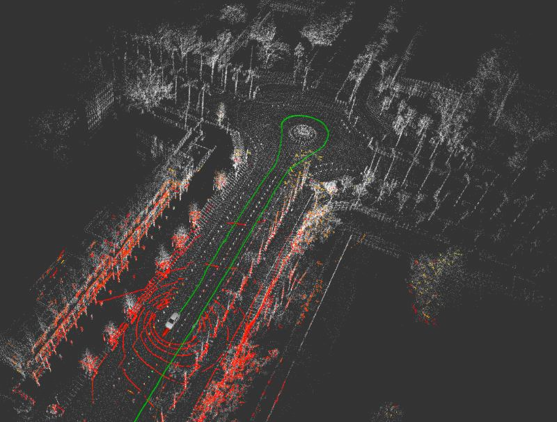
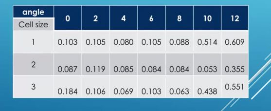
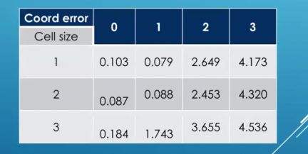
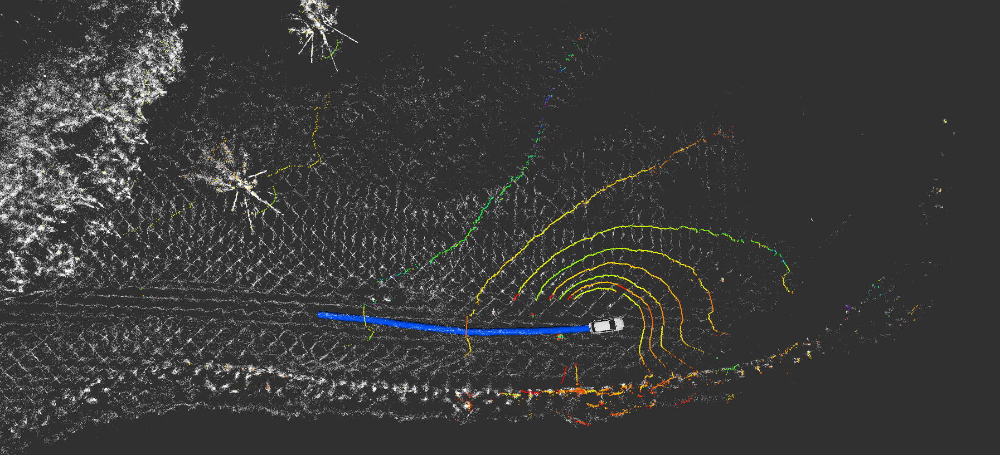
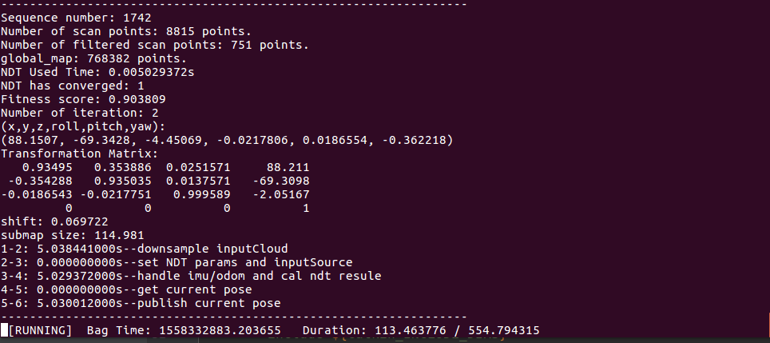
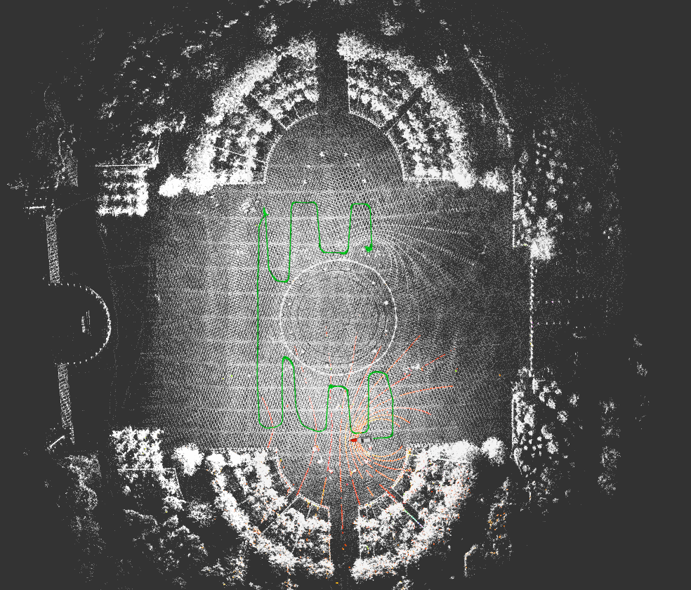
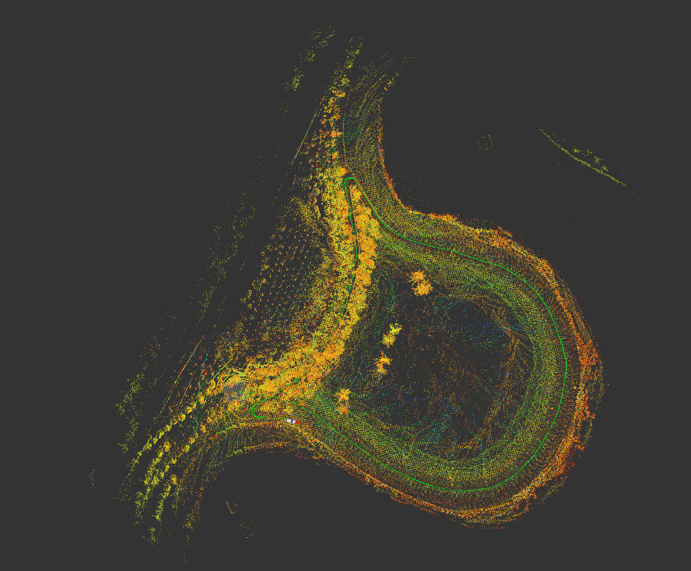
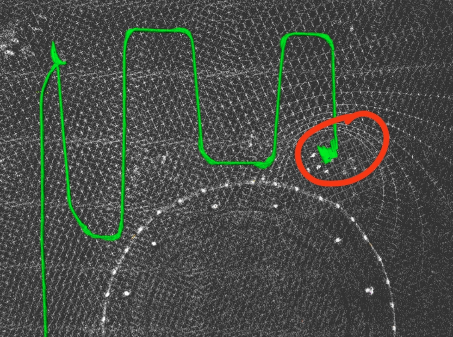

# 自动驾驶实战系列(一)——利用NDT算法构建点云地图

作为系列的第一篇，主要讲解室外构建点云地图的常用方法，以及基本原理和实现。主要是一个基于NDT的激光里程计，然后配合IMU/Odom/Gps等传感器提供的初值，完成地图构建。



<!-- more-->

NDT算法原理见之前的博客(参考别人的，待修订)

<a href="http://xchu.net/2019/09/14/NDT%E5%8E%9F%E7%90%86%E6%8E%A8%E5%AF%BC/"  class="LinkCard">NDT原理推导</a>

阅读马丁博士以下几篇文章，第一篇是其博士论文，ndt的求解过程介绍十分详细，我仔细留意了下马丁博士的个人主页，他在09年博士毕业之后到现在，期间的十年也有好几篇NDT相关的文章发表，大家可以留意下。

> 1. **Doctoral Thesis**：The Three-Dimensional Normal-Distributions Transform —an Efficient Representation for Registration, Surface Analysis, and Loop Detection
> 2. 2009_ICRA_Appearance-Based Loop Detection from 3D Laser Data
> 3. 2003_IROS_The Normal Distributions Transform A New Approach to Laser Scan

在高精地图制作的环节中，制作点云地图是第一步，本章我们主要应用`NDT（Normal Distributions Transform`，正态分布变换）完成点云地图的构建。当然点云地图的构建方法还有很多，比如`LOAM系列(VLOAM/ALOAM/LEGO LOAM)`等各种激光slam方法。本篇我们将完成一个激光里程计，无回环，所以制图效果会比较粗糙，后续的文章会逐渐加入。基础代码来源于Autoware，个人将其剥离出来，加上一些修改，作为单独的ros模块，方便个人理解。

​	我的激光雷达型号Robosense 16，mapping过程是离线的，对电脑性能要求较高，并且内存尽量大。

​	这里说明一点，自动驾驶里面的建图和定位，是与机器人领域中的slam有一定的区别。后者要求实时，所以会注重一些性能和精度的平衡，但自动驾驶的定位一般是基于地图的，所以**地图是离线制作的，精度越高越好**，而不太注重性能。虽说自动驾驶汽车在运动过程中很少存在回环的情况，但**回环对于提升建图精度**十分重要，所以采集地图数据的时候需要多跑两圈，这点不要混淆。

## 整体思路

代码的整体逻辑很清晰，主要围绕以下两个部分展开

- 获取初值（除lidar外的各种传感器callback）
- 更新transform（当前位置到原点的transform）

**scan to scan**

​	将连续帧激光点云进行ndt配准，得到两帧转换的transform，包含平移T和旋转矩阵R。若匹配成功，则将配准结果作为下一帧点云配准的初值。可得到当前的pose，进而可求相对于起始帧的transform，可将当前帧点云对齐到坐标原点，逐帧降采样加入map中，即可完成地图构建。纯lidar计算的最终变换肯定会存在累计误差，这里我们的传感器还有odom、imu，可以利用其提供ndt配准的初值，理论上会显著改善这一情况。

**保存map**

​	这里一般通过slam算法完成的是特征点地图，或者是降采样之后的地图．如果想要构建高精地图，并且是通过手工标注的方式完成，那么我们就需要构建稠密的点云地图。构建稠密地图和构建普通的特征点地图方法都是差不多，得到每一帧相对于原点的transform之后，去除此帧过远过近的噪点部分，把关键帧加入map。这里**建议保留当前帧pcd，以及其对应的pose（时间戳），在地图的后处理部分作用很大，比如可以用ndt算法将制作好的点云地图进行压缩，网格化之后，每个网格保存点的均值和协方差，还可以保存高度均值-协方差，强度均值-协方差，进而大大压缩地图体积，可用来制作概率地图。**


## CallBack

在本篇的建图中，会用到一些其他的传感器比如imu/odom/gps数据，也可以用纯lidar，只是用到了传感器的相关数据作为辅助，谈不上融合。

### Sub and Pub

订阅相关话题，包括lidar/odom/imu，发布出来的有当前的当前已构建好的map话题/ndt_map，当前的激光点云/current_points，以及当前车辆运动的odometry话题/ndt_odom．

```c++
ndt_map_pub = nh.advertise<sensor_msgs::PointCloud2>("/ndt_map", 5);
//		dense_map_pub = nh.advertise<sensor_msgs::PointCloud2>("/dense_map", 1000);
odom_pub = nh.advertise<nav_msgs::Odometry>("/ndt_odom", 5, false);
current_points_pub = nh.advertise<sensor_msgs::PointCloud2>("/current_points", 5);

points_sub = nh.subscribe(_lidar_topic, 5, &LidarMapping::points_callback, this);
odom_sub = nh.subscribe(_odom_topic, 5, &LidarMapping::odom_callback, this);
imu_sub = nh.subscribe(_imu_topic, 5, &LidarMapping::imu_callback, this);
```

### PointCloud

**预处理**

对于激光雷达,其过近的点由于落在车体上,过远的点已经非常稀疏,因此都需要被过滤掉。

```c++
// tmp为初始点云，截取有效范围内的点存到scan中
for (auto point:tmp.points) {
    r = std::sqrt(pow(point.x, 2.0) + pow(point.y, 2.0));
    if (min_scan_range < r && r < max_scan_range) {
        scan.points.push_back(point);
    }
}
pcl::PointCloud<pcl::PointXYZI>::Ptr scan_ptr(new pcl::PointCloud<pcl::PointXYZI>(scan));  // scan保存到scan_ptr中
```

同时把第一帧激光点云加入map中，initial_scan_loaded标记这里是第一帧激光点云，后续的点云配准完成后直接加入map中来。


```c++
  if (initial_scan_loaded == 0)
  {
    pcl::transformPointCloud(*scan_ptr, *transformed_scan_ptr, tf_btol); 
    map += *transformed_scan_ptr;
    initial_scan_loaded = 1;
  }
```

这里的tf_btol是初始设定的，初始化tf_btol以获得初始变换矩阵，当车辆初始的起点不在预定义的globalMap原点时，就需要tf_btol了，后面配准的时候都是相对于localMap的原点，因此tf_ltob.inv将作为补偿的矩阵


```c++
// 根据初始设定的_tf,_roll等,初始化tl_btol rot_x_btol等
Eigen::Translation3f tl_btol(_tf_x, _tf_y, _tf_z);                
Eigen::AngleAxisf rot_x_btol(_tf_roll, Eigen::Vector3f::UnitX());  // rot: rotation
Eigen::AngleAxisf rot_y_btol(_tf_pitch, Eigen::Vector3f::UnitY());
Eigen::AngleAxisf rot_z_btol(_tf_yaw, Eigen::Vector3f::UnitZ());

tf_btol = (tl_btol * rot_z_btol * rot_y_btol * rot_x_btol).matrix();
tf_ltob = tf_btol.inverse();  // 将tf_btol取逆
```

**降采样**

```c++
//  用voxelgrid对点云进行降采样，存入filtered_scan_ptr
pcl::VoxelGrid<pcl::PointXYZI> voxel_grid_filter;
voxel_grid_filter.setLeafSize(voxel_leaf_size, voxel_leaf_size, voxel_leaf_size);
voxel_grid_filter.setInputCloud(scan_ptr);
voxel_grid_filter.filter(*filtered_scan_ptr);
```

### IMU

这里imu数据在使用之前，需要确定一下方向，是否需要进行坐标轴的正负变换．只需要保证imu测量而得实时的yaw角和车头方向基本保持一致．这里特别需要注意，通**常我们在汽车上使用的imu分六轴和九轴的，九轴的imu是带有地磁仪的，那么imu测量的yaw角就是相当于地球正北方向的夹角，即为车头方向，数据可直接使用。如果是六轴的，那么测量出来的yaw角是相对于车身的，不能直接作为车头方向，需要计算连续帧的增量数据才能使用。对于组合导航而言，一般搭载的imu是六轴的，但是由于GPS双天线，可以得到正北的方向，最终融合输出的yaw角为和正北方向的夹角，能够直接使用。**

​	这里我们需要自己的传感器设备有一个清楚的了解，可以参考我的第三篇文章，测试一下IMU的朝向问题。

<a href="http://xchu.net/2020/01/10/37gnss-localizer/#more"  class="LinkCard">自动驾驶实战系列(四)——地理与平面坐标系对齐及INS数据可视化</a>

```c++
void imu_callback(const sensor_msgs::Imu::Ptr &input) {
    if (_imu_upside_down)  // _imu_upside_down指示是否进行imu的正负变换
        imuUpSideDown(input);

    const ros::Time current_time = input->header.stamp;
    static ros::Time previous_time = current_time;
    const double diff_time = (current_time - previous_time).toSec();

    // 解析imu消息,获得rpy
    double imu_roll, imu_pitch, imu_yaw;
    tf::Quaternion imu_orientation;
    tf::quaternionMsgToTF(input->orientation, imu_orientation);
    tf::Matrix3x3(imu_orientation).getRPY(imu_roll, imu_pitch, imu_yaw);

    imu_roll = warpToPmPi(imu_roll);  // 保持在±180°内，角度转弧度
    imu_pitch = warpToPmPi(imu_pitch);
    imu_yaw = warpToPmPi(imu_yaw);

    static double previous_imu_roll = imu_roll, previous_imu_pitch = imu_pitch, previous_imu_yaw = imu_yaw;
    const double diff_imu_roll = calcDiffForRadian(imu_roll, previous_imu_roll);
    const double diff_imu_pitch = calcDiffForRadian(imu_pitch, previous_imu_pitch);
    const double diff_imu_yaw = calcDiffForRadian(imu_yaw, previous_imu_yaw);

    imu.header = input->header;//瞬时加速度只考虑x方向
    imu.linear_acceleration.x = input->linear_acceleration.x;
    // imu.linear_acceleration.y = input->linear_acceleration.y;
    // imu.linear_acceleration.z = input->linear_acceleration.z;
    imu.linear_acceleration.y = 0;
    imu.linear_acceleration.z = 0;

    if (diff_time != 0) {
        imu.angular_velocity.x = diff_imu_roll / diff_time;
        imu.angular_velocity.y = diff_imu_pitch / diff_time;
        imu.angular_velocity.z = diff_imu_yaw / diff_time;
    } else {
        imu.angular_velocity.x = 0;
        imu.angular_velocity.y = 0;
        imu.angular_velocity.z = 0;
    }

    imu_calc(input->header.stamp);//后面详细讲解

    previous_time = current_time;
    previous_imu_roll = imu_roll;
    previous_imu_pitch = imu_pitch;
    previous_imu_yaw = imu_yaw;
}
```

### ODOM

```c++
void odom_callback(const nav_msgs::Odometry::ConstPtr &input) {
    odom = *input;
    odom_calc(input->header.stamp);//后续讲解
}
```

### GPS

如果有GPS当然也可以用GPS来提供初值，这里有些GPS会提供heading角和位置，有些则只有位置。有heading角的更准，只有位置也没关系，**通过连续的位置坐标，也可以计算一个平面运动的yaw角**，这种计算方法在我的系列博客中经常提到，这里只给出基本的代码，转换成T矩阵部分就参考之前的代码即可。

**无heading**

```c++
geometry_msgs::PoseStamped pose;
pose.header = msg.header;
pose.header.stamp = msg.header.stamp;
pose.header.frame_id = "map";
pose.pose.position.x = gps_pos_(0); //gps位置
pose.pose.position.y = gps_pos_(1);
pose.pose.position.z = gps_pos_(2);

//  仅依靠位置点，计算yaw
double distance = sqrt(pow(pose.pose.position.y - _prev_pose.pose.position.y, 2) + pow(pose.pose.position.x - _prev_pose.pose.position.x, 2));
if (distance > 0.2)
{
    // 返回值是此点与远点连线与x轴正方向的夹角
    yaw = atan2(pose.pose.position.y - _prev_pose.pose.position.y, pose.pose.position.x - _prev_pose.pose.position.x);
    _quat = tf::createQuaternionMsgFromYaw(yaw);
    _prev_pose = pose;
}
pose.pose.orientation = _quat;　//yaw转四元数
```

**有heading**

```c++
//有heading
gps_heading_time_ = heading_msg->header.stamp;
gps_heading_ = Eigen::Quaterniond(q.z, 0, 0, q.w); // gps heading to map
has_heading_ = true;

if (has_pos_) {
    NODELET_INFO("INITIAL POSE AND HEADING...");

    auto ros_time_diff = gps_pos_time_ - gps_heading_time_;
    double time_diff = ros_time_diff.toSec();

    Eigen::Isometry3d e;
    e.setIdentity();
    if (has_heading_ && std::fabs(time_diff) < 0.5) {
        e.prerotate(gps_heading_);
    } else {
        e.prerotate(Eigen::Quaterniond::Identity());
    }
    e.pretranslate(gps_pos_);

    geometry_msgs::PoseStamped heading_pose;
    heading_pose.header = heading_msg->header;
    heading_pose.header.stamp = heading_msg->header.stamp;
    heading_pose.header.frame_id = "map";
    heading_pose.pose.position.x = gps_pos_(0);//位置
    heading_pose.pose.position.y = gps_pos_(1);
    heading_pose.pose.position.z = gps_pos_(2);

    heading_pose.pose.orientation.x = gps_heading_.x();//heading角
    heading_pose.pose.orientation.y = gps_heading_.y();
    heading_pose.pose.orientation.z = gps_heading_.z();
    heading_pose.pose.orientation.w = gps_heading_.w();
    heading_pub.publish(heading_pose);

    has_pos_ = false;
    has_heading_ = false;
}
```

## NDT配准

### **参数设置**

这里需要注意的关键参数是，ndt网格的分辨率，这个大小和激光雷达的型号相关，比如我用的robosense16，这款激光雷达一圈扫描的点可能只有velodyne16的1/3，所以我设定的网格大小是2.0，网格太小会导致网格中点的数量不够，太大导致精度降低。

```c++
  ndt.setTransformationEpsilon(trans_eps); // 两次变换之间允许的最大值,用于判断是否收敛,作为迭代计算完成的阈值; =0.01
  ndt.setStepSize(step_size); //牛顿法优化的最大步长 0.1
  ndt.setResolution(ndt_res);  //ndt cell的分辨率,我设定的是2.0，一般0.1-1，太大导致精度下降，太小导致内存撑爆
  ndt.setMaximumIterations(max_iter); //ndt的最大迭代次数 这里我设置的是30
  ndt.setInputSource(filtered_scan_ptr);  // 输入source点云
```

这里接着考虑map，如果是第一帧激光，会和初始的map配准，初始map为空。

```c++
 static bool is_first_map = true;
  if (is_first_map == true){
    ndt.setInputTarget(map_ptr);
    is_first_map = false;
  }
```

考虑我们需要输出的pose，这里为避免混淆，我们定了guess_pose、previous_pose、guess_pose_for_ndt。其中guess_pose为当前时刻的初值，即ndt计算的初始估计位置,在不使用gnss/imu/odom的情况下,以上一帧车辆位置的变换矩阵（previous_pose）作为guess_pose，最后输出当前帧配准完成的guess_pose_for_ndt。

```c++
// 初始pose
guess_pose.x = previous_pose.x + diff_x;
guess_pose.y = previous_pose.y + diff_y;
guess_pose.z = previous_pose.z + diff_z;
guess_pose.roll = previous_pose.roll;
guess_pose.pitch = previous_pose.pitch;
guess_pose.yaw = previous_pose.yaw + diff_yaw; //平面上运动，近似只有偏航角变化
pose guess_pose_for_ndt;
guess_pose_for_ndt = guess_pose;

Eigen::AngleAxisf init_rotation_x(guess_pose_for_ndt.roll, Eigen::Vector3f::UnitX()); //沿X轴转roll
Eigen::AngleAxisf init_rotation_y(guess_pose_for_ndt.pitch, Eigen::Vector3f::UnitY());
Eigen::AngleAxisf init_rotation_z(guess_pose_for_ndt.yaw, Eigen::Vector3f::UnitZ());
Eigen::Translation3f init_translation(guess_pose_for_ndt.x, guess_pose_for_ndt.y, guess_pose_for_ndt.z);

//  旋转向量->初始的变换矩阵 角度*模长
Eigen::Matrix4f init_guess = (init_translation * init_rotation_z * init_rotation_y * init_rotation_x).matrix() * tf_btol;
```

### **获取NDT初值**

对于NDT算法而言，当匹配的两帧点云已确定，配准结果很大程度上取决于初值的好坏，当然没有icp对初值那么敏感．不管是ndt还是icp，最终求出了cost function，都是采用牛顿法进行迭代优化，所以配准时间和迭代次数息息相关。这里我们有四种初值的获取方法，纯lidar建图的话，采用上一帧的变换作为初值，在有odom和imu的情况下，可以用这两个融合一个初值，有gps的话，也可以用gps计算初值。

```c++
pose guess_pose_for_ndt; //命名guess_pose_for_ndt，方便处理
if (_use_imu && _use_odom) {
    guess_pose_for_ndt = guess_pose_imu_odom;
    std::cout << " use imu_odom guess pose" << std::endl;
} else if (_use_imu && !_use_odom) {
    std::cout << " use imu guess pose" << std::endl;
    guess_pose_for_ndt = guess_pose_imu;
} else if (!_use_imu && _use_odom) {
    std::cout << " use odom guess pose" << std::endl;
    guess_pose_for_ndt = guess_pose_odom;
} else {
    std::cout << " use origin guess pose" << std::endl;
    guess_pose_for_ndt = guess_pose;
}

//　计算init_guess
Eigen::AngleAxisf init_rotation_x(static_cast<const float &>(guess_pose_for_ndt.roll), Eigen::Vector3f::UnitX());
Eigen::AngleAxisf init_rotation_y(static_cast<const float &>(guess_pose_for_ndt.pitch), Eigen::Vector3f::UnitY());
Eigen::AngleAxisf init_rotation_z(static_cast<const float &>(guess_pose_for_ndt.yaw), Eigen::Vector3f::UnitZ());

Eigen::Translation3f init_translation(static_cast<const float &>(guess_pose_for_ndt.x),static_cast<const float &>(guess_pose_for_ndt.y), static_cast<const float &>(guess_pose_for_ndt.z));

Eigen::Matrix4f init_guess =　(init_translation * init_rotation_z * init_rotation_y * init_rotation_x).matrix() * tf_btol; 
```

对于guess_pose，上面已经用previous_pose赋值．对于传感器imu/encoder均为增量型的，无法直接使用其瞬时值，而是需要计算在短时间内(前后两帧)的增量。对于imu而言，加速度计测量比较准，一次积分出来的速度，和二次积分出来的位移都会存在较大误差。

```c++
void imu_calc(ros::Time current_time) {
    static ros::Time previous_time = current_time;
    double diff_time = (current_time - previous_time).toSec();

    double diff_imu_roll = imu.angular_velocity.x * diff_time;
    double diff_imu_pitch = imu.angular_velocity.y * diff_time;
    double diff_imu_yaw = imu.angular_velocity.z * diff_time;

    current_pose_imu.roll += diff_imu_roll;
    current_pose_imu.pitch += diff_imu_pitch;
    current_pose_imu.yaw += diff_imu_yaw;

    // 对imu由于不平衡造成的补偿问题
    double accX1 = imu.linear_acceleration.x;
    double accY1 = std::cos(current_pose_imu.roll) * imu.linear_acceleration.y -std::sin(current_pose_imu.roll) * imu.linear_acceleration.z;
    double accZ1 = std::sin(current_pose_imu.roll) * imu.linear_acceleration.y + std::cos(current_pose_imu.roll) * imu.linear_acceleration.z;

    double accX2 = std::sin(current_pose_imu.pitch) * accZ1 + std::cos(current_pose_imu.pitch) * accX1;
    double accY2 = accY1;
    double accZ2 = std::cos(current_pose_imu.pitch) * accZ1 - std::sin(current_pose_imu.pitch) * accX1;

    double accX = std::cos(current_pose_imu.yaw) * accX2 - std::sin(current_pose_imu.yaw) * accY2;
    double accY = std::sin(current_pose_imu.yaw) * accX2 + std::cos(current_pose_imu.yaw) * accY2;
    double accZ = accZ2;

  // imu计算xyz方向上的偏移,再加上考虑加速度以及时间参数,获得较为准确的距离偏移
    offset_imu_x += current_velocity_imu_x * diff_time + accX * diff_time * diff_time / 2.0;
    offset_imu_y += current_velocity_imu_y * diff_time + accY * diff_time * diff_time / 2.0;
    offset_imu_z += current_velocity_imu_z * diff_time + accZ * diff_time * diff_time / 2.0;

    current_velocity_imu_x += accX * diff_time;  // imu的速度值会通过slam进行修正,以避免累计误差
    current_velocity_imu_y += accY * diff_time;  // 或者说imu计算时所用的速度并不是用imu得到的,而是用slam得到的
    current_velocity_imu_z += accZ * diff_time;    // imu所提供的参数,主要用来计算角度上的偏移,以及加速度导致的距离上的偏移!@

    offset_imu_roll += diff_imu_roll;
    offset_imu_pitch += diff_imu_pitch;
    offset_imu_yaw += diff_imu_yaw;

    guess_pose_imu.x = previous_pose.x + offset_imu_x;
    guess_pose_imu.y = previous_pose.y + offset_imu_y;
    guess_pose_imu.z = previous_pose.z + offset_imu_z;
    guess_pose_imu.roll = previous_pose.roll + offset_imu_roll;
    guess_pose_imu.pitch = previous_pose.pitch + offset_imu_pitch;
    guess_pose_imu.yaw = previous_pose.yaw + offset_imu_yaw;

    previous_time = current_time;
}
```

对于odometry而言，通过测量轮速来获取实时的速度，测量比较准，而由速度根据运动模型计算出的加速度等值也是有一定问题的．

```c++
void odom_calc(ros::Time current_time) {
    static ros::Time previous_time = current_time;
    double diff_time = (current_time - previous_time).toSec();

    double diff_odom_roll = odom.twist.twist.angular.x * diff_time;
    double diff_odom_pitch = odom.twist.twist.angular.y * diff_time;
    double diff_odom_yaw = odom.twist.twist.angular.z * diff_time;

    current_pose_odom.roll += diff_odom_roll;
    current_pose_odom.pitch += diff_odom_pitch;
    current_pose_odom.yaw += diff_odom_yaw;

    double diff_distance = odom.twist.twist.linear.x * diff_time;
    offset_odom_x += diff_distance * cos(-current_pose_odom.pitch) * cos(current_pose_odom.yaw);
    offset_odom_y += diff_distance * cos(-current_pose_odom.pitch) * sin(current_pose_odom.yaw);
    offset_odom_z += diff_distance * sin(-current_pose_odom.pitch);

    offset_odom_roll += diff_odom_roll;
    offset_odom_pitch += diff_odom_pitch;
    offset_odom_yaw += diff_odom_yaw;

    guess_pose_odom.x = previous_pose.x + offset_odom_x;
    guess_pose_odom.y = previous_pose.y + offset_odom_y;
    guess_pose_odom.z = previous_pose.z + offset_odom_z;
    guess_pose_odom.roll = previous_pose.roll + offset_odom_roll;
    guess_pose_odom.pitch = previous_pose.pitch + offset_odom_pitch;
    guess_pose_odom.yaw = previous_pose.yaw + offset_odom_yaw;

    previous_time = current_time;
}
```

我们可以结合这两个传感器的优势和劣势，只用imu的陀螺仪和odom的速度，算出一个更可靠的初值．

```c++
 void imu_odom_calc(ros::Time current_time) {
     static ros::Time previous_time = current_time;
     double diff_time = (current_time - previous_time).toSec();  // static声明的变量只会在第一次使用时被声明,因此不会被覆盖

     // imu只使用陀螺仪,即 只输出转角信息roll,pitch,yaw
     double diff_imu_roll = imu.angular_velocity.x * diff_time;
     double diff_imu_pitch = imu.angular_velocity.y * diff_time;
     double diff_imu_yaw = imu.angular_velocity.z * diff_time;

     current_pose_imu_odom.roll += diff_imu_roll;  
     current_pose_imu_odom.pitch += diff_imu_pitch;
     current_pose_imu_odom.yaw += diff_imu_yaw;

     // odom信息处理,计算 -- xyz移动距离的计算,融合odom的速度(位移)信息和imu的转角信息
     double diff_distance = odom.twist.twist.linear.x * diff_time;
     offset_imu_odom_x += diff_distance * cos(-current_pose_imu_odom.pitch) * cos(current_pose_imu_odom.yaw);
     offset_imu_odom_y += diff_distance * cos(-current_pose_imu_odom.pitch) * sin(current_pose_imu_odom.yaw);
     offset_imu_odom_z += diff_distance * sin(-current_pose_imu_odom.pitch);

     offset_imu_odom_roll += diff_imu_roll;
     offset_imu_odom_pitch += diff_imu_pitch;
     offset_imu_odom_yaw += diff_imu_yaw;

     // 融合imu和odom输出一个guess_pose
     // 注:guess_pose是在previous_pose基础上叠加一个offset,包括xyz的和rpy的
     // xyz的offset需要融合imu的转角和odom的速度(位移)
     // rpy的offset直接采用imu的rpy偏差值
     guess_pose_imu_odom.x = previous_pose.x + offset_imu_odom_x;
     guess_pose_imu_odom.y = previous_pose.y + offset_imu_odom_y;
     guess_pose_imu_odom.z = previous_pose.z + offset_imu_odom_z;
     guess_pose_imu_odom.roll = previous_pose.roll + offset_imu_odom_roll;
     guess_pose_imu_odom.pitch = previous_pose.pitch + offset_imu_odom_pitch;
     guess_pose_imu_odom.yaw = previous_pose.yaw + offset_imu_odom_yaw;

     previous_time = current_time;
 }
```

利用gps提供初值的方法在上一节已经讲过，这里直接拿实时的gps位置＋姿态即可，而不需要计算增量．

### **NDT配准**


```c++
pcl::PointCloud<pcl::PointXYZI>::Ptr output_cloud(new pcl::PointCloud<pcl::PointXYZI>);

ndt.align(*output_cloud, init_guess); //开始配准
fitness_score = ndt.getFitnessScore(); //配准得分
t_localizer = ndt.getFinalTransformation(); //配准成功得到的变换矩阵
has_converged = ndt.hasConverged();
final_num_iteration = ndt.getFinalNumIteration(); //最终迭代次数
transformation_probability = ndt.getTransformationProbability();
```

output_cloud: 存储source经过配准后的点云(由于source_pointcloud被极大的降采样了,因此这个数据没什么用)，我们只需要得到变换矩阵，再把scan_ptr变换过去，加入map中即可。

```cpp
t_base_link = t_localizer * tf_ltob; //当前时刻相对于原点的变换（定位）
pcl::transformPointCloud(*scan_ptr, *transformed_scan_ptr, t_localizer); // 对原始点云进行变换
```

 注:与icp相比的话，ndt对于初值不那么敏感。**正常情况下，只要初始位置和真实位置的距离在2m内，角度在10度以内，ndt算法都能够成功匹配，并将其位置给拉回来。相比位置而言，ndt算法对角度更敏感。**

下面给出真实环境中ndt算法的测试结果，表中的数值是牛顿法优化的cost function，越小表示效果越好，当然也可能出现极端的负优化情况，这里暂不考虑。

首先**固定位置**，在初始yaw分别相差2度的情况下测试，数据表明，在yaw角变化超过10，损失值就会出现跳变，此时ndt匹配效果极差。



然后**固定yaw**，在初始位置相差0-3米内测试，数据表明，距离超过2米，匹配效果就会突变。



```c++
tf::Matrix3x3 mat_l, mat_b; //相邻帧、相对于全局的旋转矩阵

mat_l.setValue(static_cast<double>(t_localizer(0, 0)), static_cast<double>(t_localizer(0, 1)),
               static_cast<double>(t_localizer(0, 2)), static_cast<double>(t_localizer(1, 0)),
               static_cast<double>(t_localizer(1, 1)), static_cast<double>(t_localizer(1, 2)),
               static_cast<double>(t_localizer(2, 0)), static_cast<double>(t_localizer(2, 1)),
               static_cast<double>(t_localizer(2, 2)));

mat_b.setValue(static_cast<double>(t_base_link(0, 0)), static_cast<double>(t_base_link(0, 1)),
               static_cast<double>(t_base_link(0, 2)), static_cast<double>(t_base_link(1, 0)),
               static_cast<double>(t_base_link(1, 1)), static_cast<double>(t_base_link(1, 2)),
               static_cast<double>(t_base_link(2, 0)), static_cast<double>(t_base_link(2, 1)),
               static_cast<double>(t_base_link(2, 2)));

// Update localizer_pose. 相邻帧
localizer_pose.x = t_localizer(0, 3);
localizer_pose.y = t_localizer(1, 3);
localizer_pose.z = t_localizer(2, 3);
mat_l.getRPY(localizer_pose.roll, localizer_pose.pitch, localizer_pose.yaw, 1);

// Update ndt_pose. 全局
ndt_pose.x = t_base_link(0, 3);
ndt_pose.y = t_base_link(1, 3);
ndt_pose.z = t_base_link(2, 3);
mat_b.getRPY(ndt_pose.roll, ndt_pose.pitch, ndt_pose.yaw, 1);

current_pose.x = ndt_pose.x;
current_pose.y = ndt_pose.y;
current_pose.z = ndt_pose.z;
current_pose.roll = ndt_pose.roll;
current_pose.pitch = ndt_pose.pitch;
current_pose.yaw = ndt_pose.yaw;

// tf变换 map->base_link
transform.setOrigin(tf::Vector3(current_pose.x, current_pose.y, current_pose.z));
q.setRPY(current_pose.roll, current_pose.pitch, current_pose.yaw);
transform.setRotation(q);
br.sendTransform(tf::StampedTransform(transform, current_scan_time, "map", "base_link"));
```

因为有些帧会配准失败，需要舍弃，前面的diff，即相邻帧之间的位移也需要计算

```c++
//  计算两帧时间
  scan_duration = current_scan_time - previous_scan_time;
  double secs = scan_duration.toSec();

  // Calculate the offset (curren_pos - previous_pos) 计算两帧之间的位移、速度和偏航角变化
  diff_x = current_pose.x - previous_pose.x;
  diff_y = current_pose.y - previous_pose.y;
  diff_z = current_pose.z - previous_pose.z;
  diff_yaw = calcDiffForRadian(current_pose.yaw, previous_pose.yaw);
  diff = sqrt(diff_x * diff_x + diff_y * diff_y + diff_z * diff_z);

//  匀速运动模型
  current_velocity_x = diff_x / secs;
  current_velocity_y = diff_y / secs;
  current_velocity_z = diff_z / secs;

  // Update position and posture. current_pos -> previous_pos 更新当前位姿
  previous_pose.x = current_pose.x;
  previous_pose.y = current_pose.y;
  previous_pose.z = current_pose.z;
  previous_pose.roll = current_pose.roll;
  previous_pose.pitch = current_pose.pitch;
  previous_pose.yaw = current_pose.yaw;

  previous_scan_time.sec = current_scan_time.sec;
  previous_scan_time.nsec = current_scan_time.nsec;
```

## **地图更新**

每隔n米更新一次全局地图，同时使用单独的线程,按照一定的频率进行地图的保存。注意，这里需要对当前帧进行降采样才能加入地图里。否则可能会匹配失败，我之前出现这个问题，百思不得其解，后面仔细考虑才明白。

> **匹配的当前帧预处理过程中，是做过降采样的，也可以理解成一种特征，用网格中心点代替此网格内的点云，必然会损失一些点云细节。如果是稠密建图，直接将原始点云帧加入map里面，地图细节必然会保留得更加完整，但是在当前降采样的点云帧和map做匹配的时候，就不一定能够匹配上了。**

```c++
// Calculate the shift between added_pos and current_pos
double shift = sqrt(pow(current_pose.x - added_pose.x, 2.0) + pow(current_pose.y - added_pose.y, 2.0));

//  给定两帧距离
if (shift >= min_add_scan_shift)
{
    //注意：必须降采样，才能加入map中
    pcl::VoxelGrid <pcl::PointXYZI> voxel_grid_filter_tomap;
    voxel_grid_filter_tomap.setLeafSize(voxel_leaf_size * 2, voxel_leaf_size * 2, voxel_leaf_size * 2);
    voxel_grid_filter_tomap.setInputCloud(transformed_scan_ptr);
    voxel_grid_filter_tomap.filter(*transformed_scan_ptr);

    submap_size += shift;
    map += *transformed_scan_ptr;

    added_pose.x = current_pose.x;
    added_pose.y = current_pose.y;
    added_pose.z = current_pose.z;
    added_pose.roll = current_pose.roll;
    added_pose.pitch = current_pose.pitch;
    added_pose.yaw = current_pose.yaw;

// 此时加入的target:map_ptr并不包括刚加入点云的transformed_scan_ptr
//map更新了,因此target也需要随之更新
    if (_incremental_voxel_update) 
        cpu_ndt.updateVoxelGrid(transformed_scan_ptr);
    else
        cpu_ndt.setInputTarget(map_ptr);
}
```

发布map和当前的odometry

```c++
// ros发布map
sensor_msgs::PointCloud2::Ptr map_msg_ptr(new sensor_msgs::PointCloud2);
pcl::toROSMsg(*map_ptr, *map_msg_ptr);
ndt_map_pub.publish(*map_msg_ptr);

 // publish the odom
nav_msgs::Odometry odom;
odom.header.stamp = current_scan_time;
odom.header.frame_id = "map";

odom.pose.pose.position.x = current_pose.x;
odom.pose.pose.position.y = current_pose.y;
odom.pose.pose.position.z = current_pose.z;

odom.pose.pose.orientation.x = q.x();
odom.pose.pose.orientation.y = q.y();
odom.pose.pose.orientation.z = q.z();
odom.pose.pose.orientation.w = q.w();

odom.child_frame_id = "base_link";
odom.twist.twist.linear.x = current_velocity_x;
odom.twist.twist.linear.y = current_velocity_y;
odom.twist.twist.angular.z = current_velocity_z;

odom_pub.publish(odom);

//  实时的点云
sensor_msgs::PointCloud2::Ptr pointcloud_current_ptr(new sensor_msgs::PointCloud2);
pcl::toROSMsg(*transformed_scan_ptr, *pointcloud_current_ptr);
pointcloud_current_ptr->header.frame_id = "map";
current_points_pub.publish(*pointcloud_current_ptr);
```

最后是一些初值的设定

```c++
  diff = 0.0, diff_x = 0.0, diff_y = 0.0, diff_z = 0.0, diff_yaw= 0.0;  // current_pose - previous_pose
  current_velocity_x = 0.0, current_velocity_y = 0.0, current_velocity_z = 0.0;

  // Default values
  max_iter = 30;        // Maximum iterations
  //static float ndt_res = 1.0;      // Resolution
  ndt_res = 1;      // Resolution
  step_size = 0.1;   // Step size
  trans_eps = 0.01;  // Transformation epsilon
  voxel_leaf_size = 0.1; // Leaf size of VoxelGrid filter.
  initial_scan_loaded = 0;
  min_scan_range = 5;
  max_scan_range = 80;   //static double min_scan_range = 1.0;
  min_add_scan_shift = 0.5;   //static double min_add_scan_shift = 0.5;
  _tf_x=0.0, _tf_y=0.0, _tf_z=0.0, _tf_roll=0.0, _tf_pitch=0.0, _tf_yaw=0.0;

  previous_pose.x = previous_pose.y = previous_pose.z = 0.0;
  previous_pose.roll = previous_pose.pitch = previous_pose.yaw = 0.0;
  ndt_pose.x = ndt_pose.y = ndt_pose.z = 0.0;
  ndt_pose.roll = ndt_pose.pitch = ndt_pose.yaw = 0.0;
  current_pose.x = current_pose.y = current_pose.z = 0.0;
  current_pose.roll = current_pose.pitch = current_pose.yaw = 0.0;
  guess_pose.x = guess_pose.y = guess_pose.z = 0.0;
  guess_pose.roll = guess_pose.pitch = guess_pose.yaw = 0.0;
  added_pose.x = added_pose.y = added_pose.z = 0.0;
  added_pose.roll = added_pose.pitch = added_pose.yaw = 0.0;

  diff_x = 0.0;
  diff_y = 0.0;
  diff_z = 0.0;
  diff_yaw = 0.0;
```

以上代码是我们整个纯激光mapping的过程，是基于cpu_ndt完成的，

> 这里如果要保存地图pcd文件的话，可以命令行保存这个/ndt_map的话题，但建图是否完成只能自己把握了。这里我们可以定义submap，定义一个submap_size来记录shift的和，给定阈值max_submap_size来判定是否停止建图。

```c++
 if (submap_size >= max_submap_size)
  {
    std::string s1 = "submap_";
    std::string s2 = std::to_string(submap_num);
    std::string s3 = ".pcd";
//    std::string pcd_filename = s1 + s2 + s3;
    std::string pcd_filename = "/home/catalina/"+s1 + s2 + s3;

    if (submap.size() != 0)
    {
      if (pcl::io::savePCDFileBinary(pcd_filename, submap) == -1)
      {
        std::cout << "Failed saving " << pcd_filename << "." << std::endl;
      }
      std::cout << "Saved " << pcd_filename << " (" << submap.size() << " points)" << std::endl;

      map = submap;
      submap.clear();
      submap_size = 0.0;
    }
    submap_num++;
  }
```

## 最终效果

　每帧扫描到的点云中，落在地面上的点云大概占30%，地面上的点云对抑制z轴漂移还是有很大作用的，因此，**在NDT_Mapping中进行配准时保留地面**，这部分地面去除算法可以参考lego_loam，近几年也有许多其他的效果比较好的地面去除算法，比如地面平面拟合，Ransanc等，后续会专门写一两篇博客来分析。

### 添加车辆模型

​	在文章的最后，我们在可视化的部分，做一点共作，在rviz里面添加一个小车模型．做法非常简单，在launch文件中加入

```xml
 <include file="$(find vehicle_description)/launch/lexus.launch"/>
```

我修改的小车模型的代码提供在下面，放在工作空间下编译即可使用，提供了６款小车模型，可修改lexus.launch为milee.launch，vehicle_model.launch等，可视化效果如下图。



小车模型代码：`https://github.com/JokerJohn/vehicle_description.git`

### 建图效果分析

最后观察我们输出的log，可以稍作分析．一般来说，ndt是基于概率分布的算法，速度很快，迭代次数不会超过5次，score得分是越低越好，一般来说，小于1。迭代时间的话，在我的i5 8代笔记本上测试，一次迭代不到10ms，正常成功匹配一次也差不多10ms左右。在工程上可以用多线程有进行优化，可能会加快速度。



### 建图场景评价

从整个算法中我们可以发现，ndt相比如传统特征点法的优势在于，匹配速度快，可以理解成均匀采样，对点云的细节会保留得相对来说比较完整，在结构化环境/树木多的环境中，比如空旷广场/湖边等场景下，很难提取到合适的特征点，ndt算法的优势就很明显。

下面的两张图，一张是空旷广场，一张是湖边，两个场景的特点都是树木，草丛比较多，采用lego loam等算法建图的时候会失败，因为很难提取到一些线，面特征点，最终都是用ndt算法完成的建图，并且只有激光里程计部分，由此看来ndt算法还是有一些可取之处。





之前我们已经提过ndt算法的一些缺点，就是对旋转很敏感，比如下面的位置，就是匹配效果不好的情况．目前我们采用的ndt库的实现是八叉树，目前有很多变种的ndt算法，可以在一定程度上减小旋转的影响。



## 致谢

Autoware.AI

Autocore陈晨

一清创新RAMLAB

<a href="https://zhuanlan.zhihu.com/p/77623762" class="LinkCard">使用NDT（正态分布变换）进行点云建图和定位</a>

