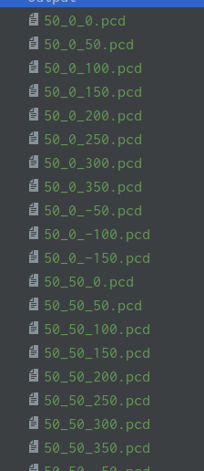

# 自动驾驶实战系列(二)——点云地图划分网格并可视化

​	系列第一篇博客有朋友反映篇幅过长，我也感觉过长不利于阅读。

​	本章将完成一个点云地图处理的工作，即对点云地图进行网格划分，这样做的好处是可以根据GPS位置动态加载相应的网格地图，大量减少内存占用。本篇主要介绍点云地图的网格划分方法以及可视化。


> ​	需要注意的是，点云地图PCD文件里面存储的都是三维的坐标点（x，y，z），这些点的值是相对于建图时起始位置（0，0，0）的距离．如果记录了建图时起始点的GPS坐标，那么点云地图里面每一个点对应的经纬高坐标，均可以转换的来．

LLA转换BLH方法见我之后的博客
<a href="http://xchu.net/2020/01/10/37gnss-localizer/#more"  class="LinkCard">自动驾驶实战系列(四)——INS数据可视化及坐标系对齐
</a>

<!-- more-->

### 一、主要思路
​	主要思路是去掉z轴，仅对平面x、y方向上的点云按自定义的grid size划分方形网格。**在定位的时候根据当前的GPS位置，可实时加载所在区域的网格点云，大量減小內存占用**。

​	点云地图网格划分是离线处理的过程，处理完成后，每一个网格PCD都按一定的格式命名，并且在csv文件中记录，方便后续按文件名加载。文章第一张图就是本篇的网格划分最终的可视化结果。在这一部分，按顺序加载点云，随机上色，以方便查看。

处理好的PCD文件示例如下:



部分csv文件命名:

```c++
50_-100_-150.pcd,-100,-150,0,-50,-100,0
50_-50_-150.pcd,-50,-150,0,0,-100,0
50_0_-150.pcd,0,-150,0,50,-100,0
50_50_-150.pcd,50,-150,0,100,-100,0
50_-100_-100.pcd,-100,-100,0,-50,-50,0
50_-50_-100.pcd,-50,-100,0,0,-50,0
50_0_-100.pcd,0,-100,0,50,-50,0
50_50_-100.pcd,50,-100,0,100,-50,0
50_100_-100.pcd,100,-100,0,150,-50,0
50_-100_-50.pcd,-100,-50,0,-50,0,0
50_-50_-50.pcd,-50,-50,0,0,0,0
50_0_-50.pcd,0,-50,0,50,0,0
50_50_-50.pcd,50,-50,0,100,0,0
50_100_-50.pcd,100,-50,0,150,0,0
50_150_-50.pcd,150,-50,0,200,0,0
50_-150_0.pcd,-150,0,0,-100,50,0
50_-100_0.pcd,-100,0,0,-50,50,0
```

### 二、实现过程

**加载原始点云地图（可能多个）**

```c++
PointCloud map;
PointCloud tmp;
for (int i = 0; i < files.size(); i++)
{
    if (pcl::io::loadPCDFile<Point>(files[i], tmp) == -1)
    {
        std::cout << "Failed to load " << files[i] << "." << std::endl;
    }
    map += tmp;
    std::cout << "Finished to load " << files[i] << "." << std::endl;
}
std::cout << "Finished to load all PCDs: " << map.size() << " points."
```

**网格划分规则**

考虑对整个点云地图文件的点**在xy方向的最大最小值**，找到x坐标，y坐标的最大最小值，记为`min_x，min_y，max_x， max_y`，形成一个长方形网格，这个网格就包含了当前地图里面所有的点．

```c++
  double min_x = 10000000000.0;
  double max_x = -10000000000.0;
  double min_y = 10000000000.0;
  double max_y = -10000000000.0;

  for (PointCloud::const_iterator p = map.begin(); p != map.end(); p++)
  {
    if (p->x < min_x)
    {
      min_x = p->x;
    }
    if (p->x > max_x)
    {
      max_x = p->x;
    }
    if (p->y < min_y)
    {
      min_y = p->y;
    }
    if (p->y > max_y)
    {
      max_y = p->y;
    }
  }
```

按照自行设定的grid_size对网格进行划分，计算网格个数

```c++
int div_x = (max_x_b - min_x_b) / grid_size;
int div_y = (max_y_b - min_y_b) / grid_size;
int grid_num = div_x * div_y;
```

找到边界网格的xy方向上的坐标

```c++
int min_x_b = grid_size * static_cast<int>(floor(min_x / grid_size));
int max_x_b = grid_size * static_cast<int>(floor(max_x / grid_size) + 1);
int min_y_b = grid_size * static_cast<int>(floor(min_y / grid_size));
int max_y_b = grid_size * static_cast<int>(floor(max_y / grid_size) + 1);
```

每个网格的四个顶点坐标可记录为（x_min，y_min）（x_min，y_max）（x_max，y_min） （x_max，y_max）,可以用网格左下角坐标（x_min，y_min）来表征此块网格的位置．那么后续如果知道了当前的GPS坐标，转化为当前位置的xy平面坐标，根据xy坐标值，可以查到当前位置在哪一个方格里面．

> 比如当前位置的平面坐标为(34，110)，网格大小为30米，那么按以上表征方法当前位置所在的方格必定为(30，90)

用左下角坐标表征唯一的网格还是较为复杂，我们考虑重新对地图里面所有的网格按先x后y，坐标从小到达的顺序进行编号，记为grid_id．

> 比如x第一行的方格依次编号为0-10，y的第二行即从11开始。grid_id_x、grid_id_y分别为方格在x、y方向上的编号，即行号和列号。lower_bound_x等四个数为当前方格的四个边界点。

**定义网格结构**

```c++
struct pcd_xyz_grid
{
  std::string filename;　//网格PCD文件名
  std::string name;
  int grid_id;　//网格编号
  int grid_id_x;　//行号
  int grid_id_y;　//列号
  int lower_bound_x;　//x_min
  int lower_bound_y; //y_min
  int upper_bound_x; //x_max
  int upper_bound_y; //y_max
  pcl::PointCloud<pcl::PointXYZ> cloud;
};
```
**重新按网格序号组织点云**

```c++
for (PointCloud::const_iterator p = map.begin(); p != map.end(); p++)
  {
    int idx = static_cast<int>(floor((p->x - static_cast<float>(min_x_b)) / grid_size));
    int idy = static_cast<int>(floor((p->y - static_cast<float>(min_y_b)) / grid_size));
    int id = idy * div_x + idx;

    const Point &tmp = *p;
    grids[id].cloud.points.push_back(tmp);
  }
```

按**一定格式定义文件名**。

划分好的PCD文件命名格式为`grid_size_x_min_y_min.pcd`，比如30_30_0，即grid size为30m，左下角顶点坐标为（30， 0）的方格。

**那么在我们只需要首次读取csv文件就可以拿到所有的网格文件名和顶点位置坐标并存储起来，后续只需要查询此文件名列表即可得知当前GPS坐标所在的网格，然后根据文件名去加载对应PCD文件即可**．

```c++
 std::vector<pcd_xyz_grid> grids(grid_num);
  for (int y = 0; y < div_y; y++)
  {
    for (int x = 0; x < div_x; x++)
    {
      int id = div_x * y + x;
      grids[id].grid_id = id; //序号
      grids[id].grid_id_x = x; //行号
      grids[id].grid_id_y = y; //列号
      grids[id].lower_bound_x = min_x_b + grid_size * x; //方格的四个顶点
      grids[id].lower_bound_y = min_y_b + grid_size * y;
      grids[id].upper_bound_x = min_x_b + grid_size * (x + 1);
      grids[id].upper_bound_y = min_y_b + grid_size * (y + 1);
      grids[id].filename = OUT_DIR + std::to_string(grid_size) + "_" +
                           std::to_string(grids[id].lower_bound_x) + "_" +
                           std::to_string(grids[id].lower_bound_y) + ".pcd";
      grids[id].name = std::to_string(grid_size) + "_" +
                       std::to_string(grids[id].lower_bound_x) + "_" +
                       std::to_string(grids[id].lower_bound_y) + ".pcd";
    }
  }
```

将点云写入pcd文件

```c++
  int points_num = 0;
  for (int i = 0; i < grid_num; i++)
  {
    if (grids[i].cloud.points.size() > 0)
    {
      pcl::io::savePCDFileBinary(grids[i].filename, grids[i].cloud);
      std::cout << "Wrote " << grids[i].cloud.points.size() << " points to "
                << grids[i].filename << "." << std::endl;
      points_num += grids[i].cloud.points.size();
    }
  }
  write_csv(grids);
  std::cout << "Total points num: " << points_num << " points." << std::endl;
```

同时把每一个网格的相关信息按一定格式存储到csv文件中，方便查找。每一行存储的信息为PCD文件名-网格的边界，比如`30_-90_-120.pcd,-90,-120,0,-60,-90,0`

```c++
void write_csv(std::vector<pcd_xyz_grid> &grids)
{
  std::string whole_file_name = OUT_DIR + FILE_NAME;
  std::ofstream ofs(whole_file_name.c_str());
  int grid_num = grids.size();
  for (int i = 0; i < grid_num; i++)
  {
    if (grids[i].cloud.points.size() > 0)
    {
      ofs << grids[i].name
          << "," << grids[i].lower_bound_x
          << "," << grids[i].lower_bound_y
          << "," << 0.0
          << "," << grids[i].upper_bound_x
          << "," << grids[i].upper_bound_y
          << "," << 0.0 << std::endl;
    }
  }
}
```

### 三、网格可视化

​	这里我们先用pcl加载所有的网格地图进行可视化，方便查看效果，后续在实际使用过程中，可能需要通过ROS来加载指定序号的网格，代码逻辑非常简单。

**网格pcd按文件名称排序**

这是我经常使用的一个很有用的工具函数，这里path为网格PCD的文件路径，我们需要将pcd_info.csv文件先移除，只留PCD文件。

```c++
void getAllFiles(std::string path, std::vector<std::string> &files)
{
    if (path[path.length() - 1] != '/')
        path = path + "/";
    DIR *dir;
    struct dirent *ptr;
    char base[1000];
    if ((dir = opendir(path.c_str())) == NULL)
    {
        perror("Open dir error...");
        std::cout << "Check: " << path << std::endl;
        exit(1);
    }

    while ((ptr = readdir(dir)) != NULL)
    {
        if (ptr->d_type == 8) // 文件
        {
            std::string name = ptr->d_name;
            int length = name.length();
            if (name.substr(length - 3, length - 1) == "pcd" || name.substr(length - 3, length - 1) == "PCD")
            {
                std::cout << path + name << std::endl;
                files.push_back(path + name);
            }
        }
    }
    closedir(dir);
    std::sort(files.begin(), files.end());
    return;
}

```

**加载PCD网格**

main函数里面，我们设定了输入目录，遍历读取PCD文件，用pcl_viewer可视化即可。

```c++

  std::string OUT_DIR = "/home/catalina/ndt_ws/src/smartcar/location/packages/pcl_map_tools/grid_pcd";
// Load all PCDs
    PointCloud::Ptr map_ptr(new PointCloud);
    PointCloud::Ptr tmp_ptr(new PointCloud);
    boost::shared_ptr<pcl::visualization::PCLVisualizer> viewer(new pcl::visualization::PCLVisualizer("map viewer"));

    int num = 0;
    int num2 = 255;

    for (int i = 0; i < grid_files.size(); i++)
    {
        if (pcl::io::loadPCDFile<Point>(grid_files[i], *tmp_ptr) == -1)
        {
            std::cout << "Failed to load " << grid_files[i] << "." << std::endl;
        }

        num++;
        pcl::visualization::PointCloudColorHandlerCustom<pcl::PointXYZI> single_color(tmp_ptr, random(255), random(255), random(255)); // green
        viewer->addPointCloud<pcl::PointXYZI>(tmp_ptr, single_color, "sample cloud"+num);
        viewer->setPointCloudRenderingProperties(pcl::visualization::PCL_VISUALIZER_POINT_SIZE, 1.0, "sample cloud"+num); // 设置点云大小

        *map_ptr += *tmp_ptr;
        std::cout << "Finished to load " << grid_files[i] << "." << std::endl;
    }

    std::cout << "map size:" << map_ptr->size()<< "." << std::endl;

//    pcl::visualization::PointCloudColorHandlerGenericField<pcl::PointXYZI> fildColor(map_ptr, "z"); // 按照z字段进行渲染
    while (!viewer->wasStopped())
    {
        viewer->spinOnce(100);
        boost::this_thread::sleep(boost::posix_time::microseconds(100000));
    }
```

根据初始位置动态加载网格点云的代码后续再结合定位一起来写，预计在第五篇。

### 参考及致谢

Autoware.AI

Autocore陈晨

一清创新RAMLAB

…