# 自动驾驶实战系列(三)——组合导航调试实践

自动驾驶系列博客第三篇姗姗来迟...由于篇幅过长，继续拆成两篇，逐一细致讲解。

​	近期在调试广州导远电子的INS55D组合导航设备，中间遇到了一些坑，最终算是顺利完成。基于目前主流的无人驾驶方案离不开GNSS/IMU，加之大多数厂家直接使用组合导航设备。此部分网上教程比较零散，将这一部分的工作整理出来作为自动驾驶系列博客的第三篇，我认为很有意义。

​	本篇主要说明组合导航的安装配置流程等模块，不同类型的驱动协议解析则留到下一节。本人实属新手，若文中出现错误，纯属个人理解不到位，请多指点交流。

<!--more -->

## 一、概述

### 1、设备概览

- 组合导航INS550D
- 通用4G模块DTU (型号MD-649)
- 串转USB转接线，4G吸盘天线
- 千寻服务差分账号、SIM卡
- Ins Asstiant(厂商提供)、dtucfg相关软件(官网下载)

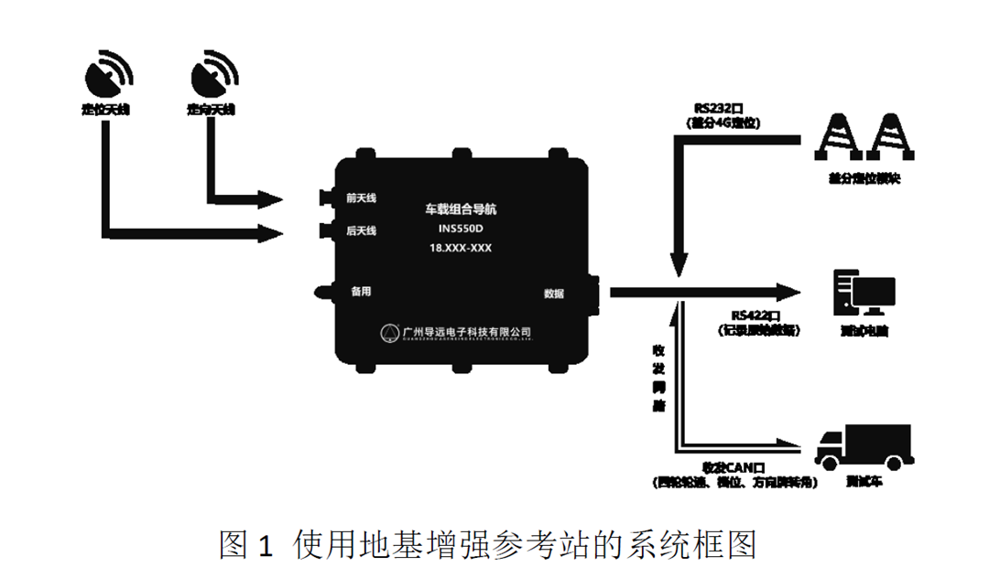

### 2、INS基本形式及原理

#### 1、只有移动站（推荐,本文的案例）

由惯性导航单元、四频双天线RTK 卫星导航接收机和4G 差分模块组成。4G 差分模块通过4G 网络接收千寻位置等RTCM 差分信息，发送给卫星导航板卡。导航计算机接收3 轴陀螺、3 轴加速度计和卫导板卡信息，实时得到精确的位置、速度、方位。

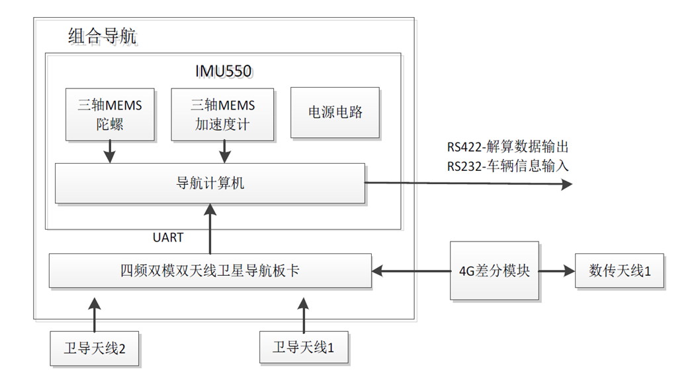

#### 2、包括移动站和CORS 站

移动站由惯性导航单元、四频双天线RTK 卫星导航接收机和数传电台组成。卫星导航接收机通过RTK 差分解算，测得载体的位置和方位角，惯性导航单元给出载体的姿态角、角速度和加速度，并运行组合导航算法得到实时位置和方位数据。CORS站由四频卫星导航接收机和数传电台组成，发送RTCM和载波信息。

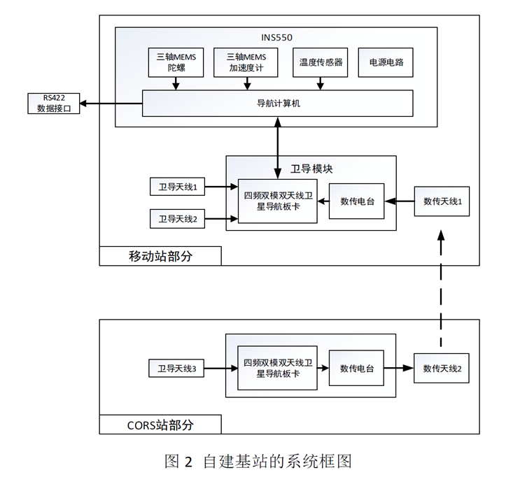

### 3、DTU原理

​	MD-649是一款具有高速数据传输能力的4G DTU产品，特别适合传输数据量大，实时性要求高的场合。
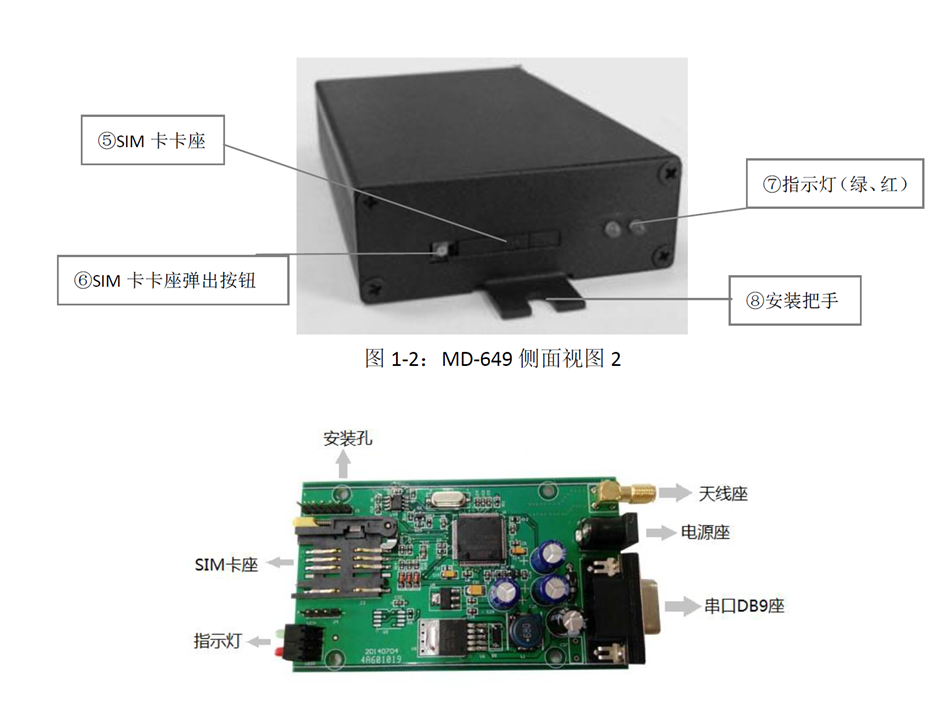
​	在MD-649中设置数据中心的IP（或域名）和端口后，MD-649利用4G无线网络拨号连上Internet，随后发起对所配的IP和端口（即mServer的监听端口）的连接，另外，用户软件系统通过虚拟串口等接口连接到mServer，进而实现了从用户设备到用户软件系统之间的无线、双向数据通信。

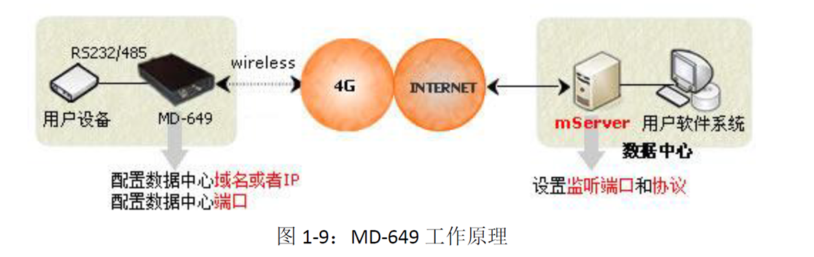

## 二、组合导航安装配置

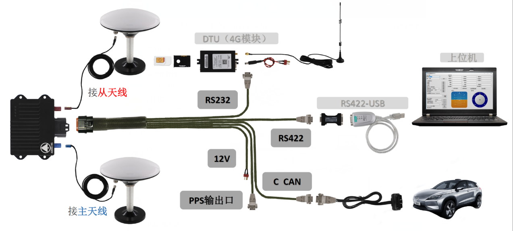

由于我并未进行过组合导航的标定工作，所以以下内容暂时不会涉及，后续有经验了再补上

### 1、安装方式

双天线位置安装，距离大于1米。

惯导安装朝向，一般惯导X轴向为车头方向。

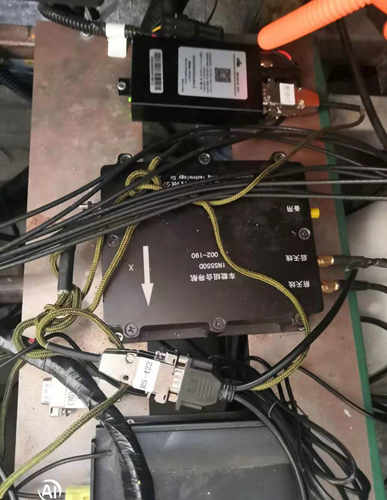

惯导、DTU、工控机连接

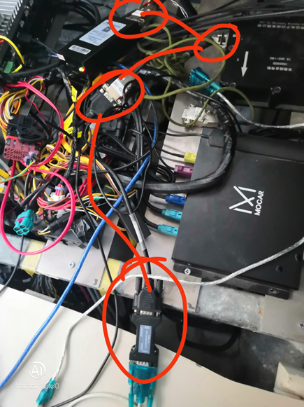

### 2、DTU配置

- 千寻差分账号：淘宝可买，每个手机号均可申请试用2小时。

- 硬件连接：笔记本（win/linux）->RS232转USB->DTU

  将SIM卡激活并安装到DTU中，打开dtucfg.exe，设置正确的串口号以及波特率(115200)

按连续回车进行配置，直到恢复出厂设置

- **修改数据中心端口号8002**

- **修改波特率115200**（此波特率为差分口输出的波特率，注意与后面RS422口输出区分开来）

- 输入NTRIP账号和密码（你的差分账号和密码，切记不同于千寻登录账号和密码）

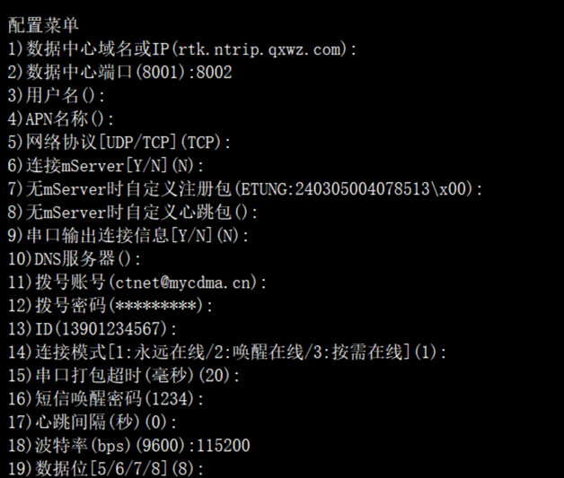

确认正常情况：**绿灯常亮（连接到数据中心）、红灯闪烁（正在传送数据）**

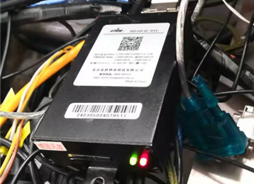

从上电到DTU连接正常可能需要半分钟左右，属正常情况。

### 3、上位机软件设置

打开Ins Asstiant选择波特率230400和串口COM6，打开串口，若当前信息显示数据在更新，即，则硬件连接成功。这里数据更新主要看以下两点

- 位置更新
- 姿态更新
- 组合导航状态

如果位置更新显示绿色，姿态更新显示蓝色，即组合导航初始化成功。

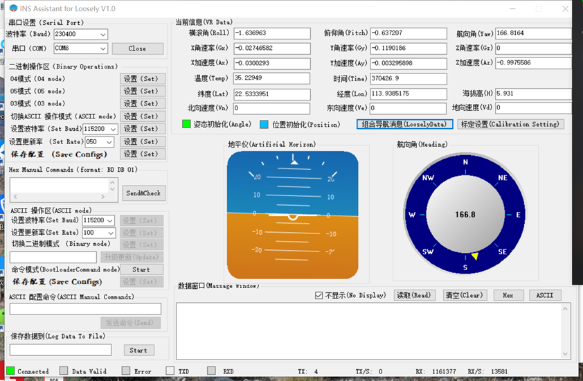

查看组合导航RTK状态。FLAG这里显示NARROW_INT，解释为窄巷固定解，收星数为19，初始化成功，RTK状态很好。
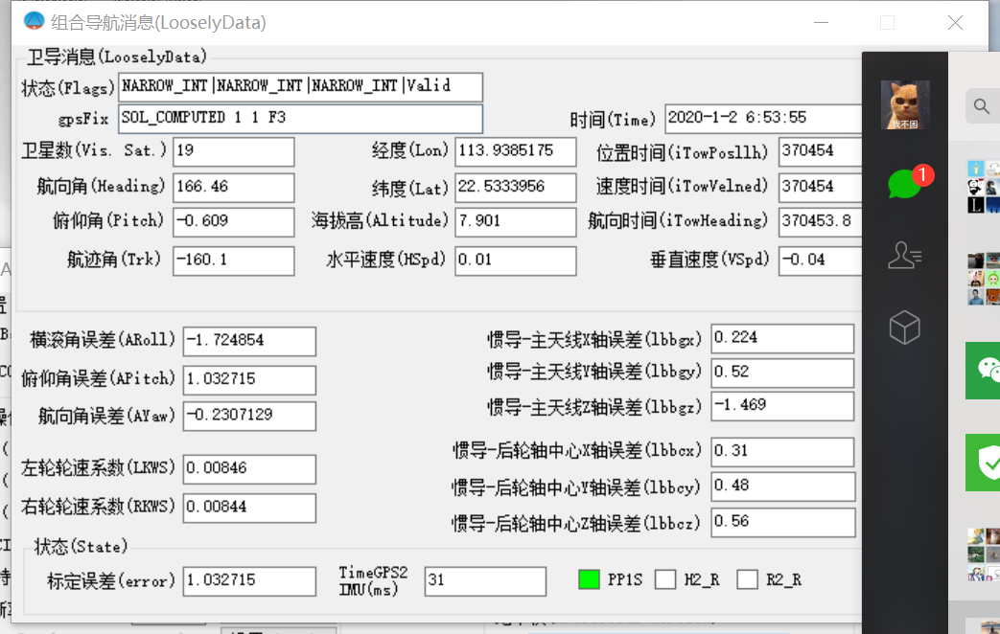

>   这里对RTK STATUS做一个简单说明
>
>   STATUS=0，即RTK无解。
>
>   STATUS = 48/49/50，L1 固定解、宽巷固定解、窄巷固定解，即为厘米级定位
>
>   STATUS=32/33/34，浮动解，即为亚米级定位。
>
>   后面会展示一下测试结果，有RTK，亚米级RTK，厘米级RTK

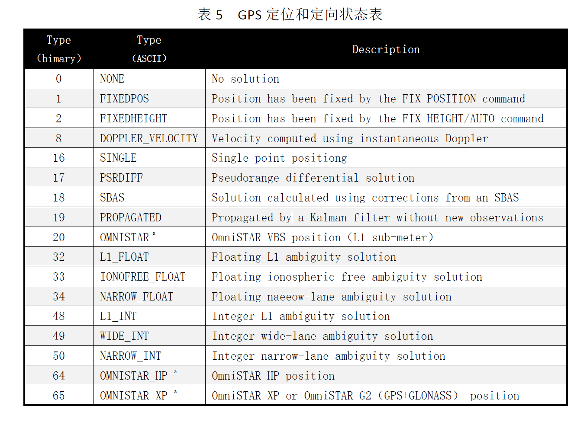

如果组合导航初始化未成功，具体检查是姿态还是位置初始化不成功。

#### 1.位置初始化失败

- DTU直接连接个人电脑。

- 检查DTU信号灯，若非绿灯常亮，红灯闪烁，则重新配置DTU，检查配置流程是否出错。

- 检查千寻差分账号是否正在服务中，可以更换账号测试，**切勿弄成千寻网站登录账号**（本人就犯过这个错，浪费不少时间）。**这里注意，即使差分账号配置错误，也是红灯闪烁，绿灯常亮的**。

这几步做完，基本可以排除位置更新的大部分问题了。

​	如果还是失败，那么就需要分析千寻服务从串口返回的数据了，可以用串口工具UartTool查看是否有数据输出，并根据数据字段联系千寻厂家加以分析原因。（千寻服务很稳定，一般不会走到这一步）

#### 2.姿态初始化失败

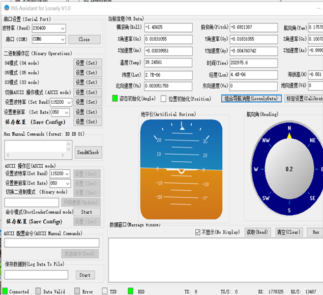

- 惯导差分口直接连接电脑。

- 打开串口工具，我这里使用的是UartTool，查看惯导COM口是否有数据输出，检查数据状态是否正常（这里需要联系厂商）。

如果无数据输出，则检查波特率是否选错，都尝试一下。

有数据输出并且乱码了，则可能是hex数据，点一下hex显示即可。有些厂家用的差分口输出ins数据，直接发的GTIMU协议数据。

数据正常输出的话，可能需要重新配置一下。

命令行向串口发送`config`指令，查看输出结果，如图所示即正常。

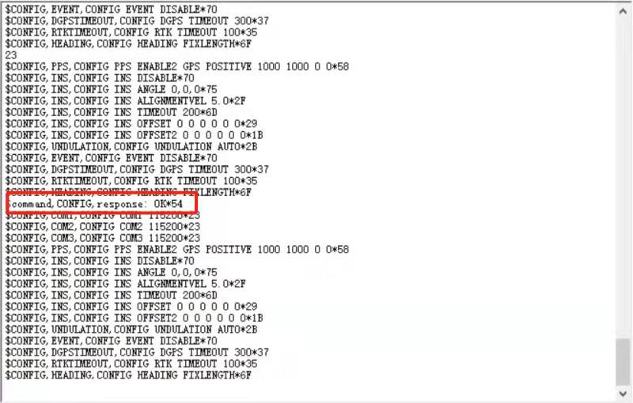

继续发送指令`CONFIG COM2 115200 8 n 1`，观察是否有`response ok`字样返回，最后发送`SAVECONFIG`即可配置完成。（这里联系惯导厂家）

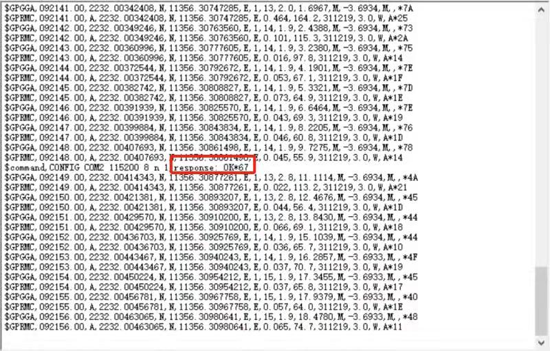

再用INS550D差分口直接连接电脑，打开上位机软件观察姿态能否初始化。

> 如果初始化失败，则用万用表量下550D的通讯线束通断情况，DB9差分口pin3对应DB15的10，DB9差分口pin2对应DB15的14，这两组通断，测量差分口和DB15。有DB15外壳上有引脚标志。

## 三、致谢

参考：INS550D、MD-649说明手册

感谢：一清创新RAMLAB、导远电子程工、中科院自动化所飞哥、主线科技刘工、哈工大刘博等