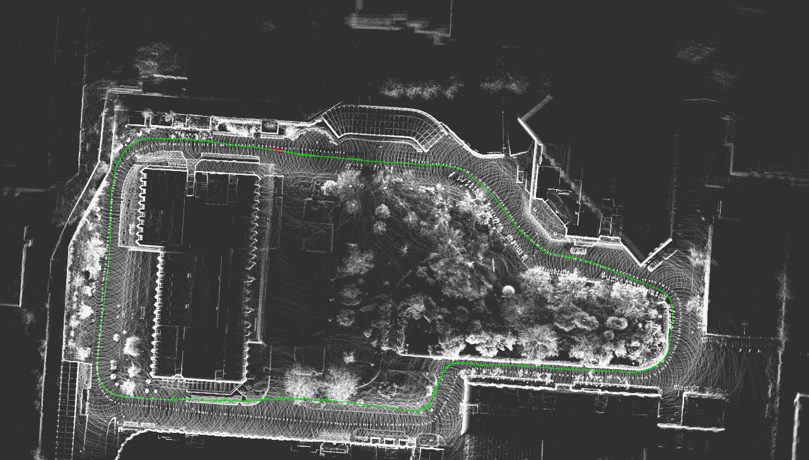
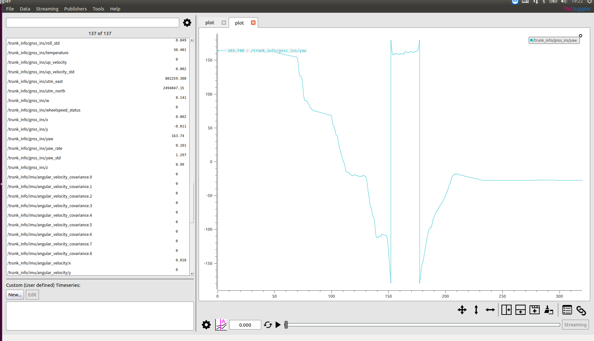
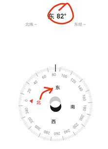
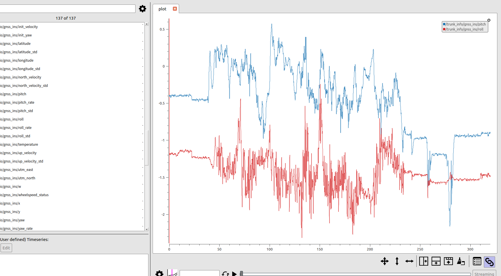
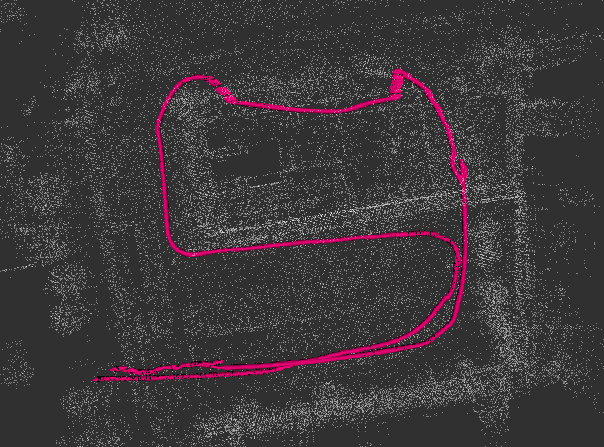
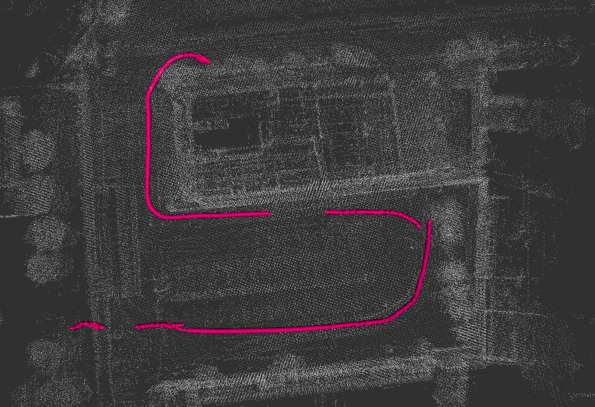

# 自动驾驶实战系列(五)——地理与平面坐标系对齐及INS数据可视化

决定还是分两篇来写吧！本篇主要介绍INS数据的可视化及基本分析。


<!-- more-->

接上一篇：

<a href="http://xchu.net/2019/12/30/35nmea/#more"  class="LinkCard">自动驾驶实战系列(三)——组合导航调试与驱动实践</a>

按第三篇步骤完成组合导航配置之后可以进行精度的测试，这里我们首先录制一个bag包，用以下两种方式来进行分析。如果有理解出错的地方，请在下方评论交流。

## 一、INS数据分析

PlotJugger是ROS提供的的插件工具，安装之后可以通过`rosrun plotjugger plotjugger`来启动，是我们查看bag包数据的常用工具。直接load bag数据包，选定指定的topic数据字段到程序中进行分析即可。如下图，这里我们主要分析位置（LLA）和姿态（YAW）变化情况。

- 经纬度轨迹是否和预期一致
- yaw角变化是否和预期一致
- 加速度/角速度变化情况

### 1、加速度/角速度简单分析

**对于角速度而言，在静止情况下应该都为0，加速度水平的话，y轴为0，z轴为重力加速度，基本为1。**


### 2、位置分析

左侧选定经纬度字段（也可以是utm_east、utm_north字段），鼠标右键拖到右侧plot中可以明显看到小车INS记录的运动轨迹，点击启动按钮，观察红色点的变动情况，可跟踪小车运行状态。显然这里我们的GPS轨迹是符合预期的。


### 3、姿态数据分析



继续查看yaw角，起始位置一直保持yaw角为160度，我们需要关注的是yaw角变化的一些节点，一般来说小车是在进行转向操作。

>   对于yaw角的取值，我们需要明确其来源。以组合导航为例，有双天线RTK时可以计算heading，即与正北方向的夹角，这里惯导输出的融合之后的yaw角肯定就是相对于正北方向的夹角，简单的说就是此时刻的yaw即为车头方向。若RTK无解，我们知道IMU上电之后测量的yaw角为0，此种情况下组合导航输出的yaw角即为相对于惯导上电时刻朝向的夹角。
>
>   组合导航仪在定位过程中，会遇到RTK无解的情况，此时输出的yaw角为第二种情况，在后续运动过程中找回了RTK有解了，也会逐步较准回来。
>
>   另外，针对于单个IMU而言，九轴IMU配有地磁仪，可以考虑为第一种情况。而六轴IMU无地磁仪，考虑为第二种情况。



**观察yaw角大小变化还有一种简单的测试方法，打开手机指南针软件，朝向车头方向沿着车的行进轨迹走，观察与正北方向的夹角变化情况，特别注意转弯地方的夹角变化，若基本一致，则yaw角数据正常。**

最后我们还可以查看一下测试路面的坡度变化，这里x轴朝向车头，坡度变化对应的是pitch角，也符合我们的预期。



> 这里提醒一下,车子在平面上加速的时候,轮胎的传动轴会有扭矩作用,让车轮转动.车子本身会有反扭矩,这个反作用力在传动轴上会有一个向上或者向下的作用力,从而使车头向上或向下.这个角度虽然肉眼看不出来,但车身的传感器能够感受到,从而产生一个较大的pitch,此pitch角可能会被误当做一个坡度信息.
>
> 这个问题我之前一直没考虑过,但在实车测试的时候发现的,目前只能通过其他的传感器来解决此问题.

## 二、可视化及坐标对齐

这里我们完成一个简单的测试程序，在地图上观察GPS轨迹和IMU朝向是否正常。



### 1、基本思路

我们需要一张点云地图及其地图原点坐标，可以通过SLAM算法完成地图构建并记录地图起点的经纬坐标。

程序的大致流程：

- 接收ins数据，LL转XY为位置，yaw角为姿态。
- 发布odometry

### 2、地理系与平面系对齐

首先地理系和平面系如何进行对齐呢？

我们知道建图的时候，如果不记录GPS数据的话，一般的slam算法完成的地图就是点云数据，地图里面存储的这些点的坐标原点，就是（0，0，0）了。如果记录下起点对应的经纬LLA坐标，那么点云地图里面的每一个位置都可以转换成经纬坐标。这样在定位的时候，我们可以把每一个GPS点在地图上标出来，就可以清晰看到小车在地图上的运动轨迹了。

这里点坐标，比如（1，1，1），即为平面系，将所有的GPS LLA坐标转换到平面系中进行后续的计算。这里坐标系转换流程，LLA->ECEF->ENU，ENU即为我们的平面系，东北天。

核心代码如下

```c++
nh.getParam("origin_longitude", origin_longitude);//点云地图原点LLA
nh.getParam("origin_latitude", origin_latitude);
nh.getParam("origin_altitude", origin_altitude);

nh.getParam("imu_topic", imu_topic);//TOPIC
nh.getParam("ins_topic", ins_topic);
nh.getParam("gps_topic", gps_topic);   

pose_pub = nh.advertise<nav_msgs::Odometry>("/odom", 1, false);//PUB or SUB
ros::Subscriber imu_sub = nh.subscribe(imu_topic, 5, imu_callback);
ros::Subscriber ins_sub = nh.subscribe(ins_topic, 5, ins_callback);
```

**INS_callback(const raw_sensor_msgs::GnssImuInfo &msg)**

```c++
sensor_msgs::NavSatFix gps_msgs;
gps_msgs.status.status = msg.gps_status;

gps_msgs.header.seq = msg.header.seq;
gps_msgs.header.stamp = msg.header.stamp;
gps_msgs.header.frame_id = msg.header.frame_id;

gps_msgs.latitude = msg.latitude;
gps_msgs.longitude = msg.longitude;
gps_msgs.altitude = msg.altitude; 


if (std::isnan(msg.latitude + msg.longitude + msg.altitude)) {
     ROS_INFO("GPS LLA NAN..."); //去NAN
     return;
 }

gpsTools gpsTools;
gpsTools.lla_origin_ << origin_latitude, origin_longitude, origin_altitude; //点云地图原点

//    if (!(msg.gps_status == 48 || msg.gps_status == 49 || msg.gps_status == 50)) {
if (msg.gps_status == 0) {
    ROS_ERROR("NO RTK.....");
    return;
}

//由于我们原来的工具类是使用NavsatFix标准格式写的转换工具类，这里我的ins是自定义的msg格式，所以就用了//gps_msg存储了经纬，方便转换
Eigen::Vector3d lla = gpsTools.GpsMsg2Eigen(gps_msgs);//LLA->ENU 
Eigen::Vector3d ecef = gpsTools.LLA2ECEF(lla);
Eigen::Vector3d enu = gpsTools.ECEF2ENU(ecef);
gps_pos_ = enu;

// publish the odometry
nav_msgs::Odometry odom;
odom.header.stamp = msg.header.stamp;
odom.header.frame_id = "map";

odom.pose.pose.position.x = gps_pos_(0);
odom.pose.pose.position.y = gps_pos_(1);
odom.pose.pose.position.z = gps_pos_(2);
//这里需要补偿这个固定的夹角，根据自己车上的情况来处理
odom.pose.pose.orientation = tf::createQuaternionMsgFromYaw(-imu_yaw+M_PI/2);

odom.child_frame_id = "base_link";
odom.twist.twist.linear.x = 0.0;
odom.twist.twist.linear.y = 0.0;
odom.twist.twist.angular.z = 0.0;

pose_pub.publish(odom);
```

**IMU_callback(const sensor_msgs::Imu::Ptr &input)**

```c++
tf::Quaternion imu_orientation;
tf::quaternionMsgToTF(input->orientation, imu_orientation);
tf::Matrix3x3(imu_orientation).getRPY(imu_roll, imu_pitch, imu_yaw);

//  角度转弧度
imu_roll = wrapToPmPi(imu_roll);
imu_pitch = wrapToPmPi(imu_pitch);
imu_yaw = wrapToPmPi(imu_yaw);
```

**工具类及全局变量**

```c++
#include <nav_msgs/Odometry.h>
#include <sensor_msgs/NavSatFix.h>
#include <boost/foreach.hpp>
#include <geometry_msgs/QuaternionStamped.h>
#include <Eigen/Core>

#define DEG_TO_RAD 0.01745329252
#define EARTH_MAJOR 6378137.0            ///< WGS84 MAJOR AXIS
#define EARTH_MINOR 6356752.31424518    ///< WGS84 MINOR AXIS

double imu_roll = 0.0, imu_pitch = 0.0, imu_yaw = 0.0;
//1.lla的起点
Eigen::Vector3d lla_origin_;
//2.enu下的坐标
Eigen::Vector3d gps_pos_;

static double wrapToPm(double a_num, const double a_max) {
    if (a_num >= a_max) {
        a_num -= 2.0 * a_max;
    }
    return a_num;
}

static double wrapToPmPi(const double a_angle_rad) {
    return wrapToPm(a_angle_rad, M_PI);
}

static double calcDiffForRadian(const double lhs_rad, const double rhs_rad) {
    double diff_rad = lhs_rad - rhs_rad;
    if (diff_rad >= M_PI)
        diff_rad = diff_rad - 2 * M_PI;
    else if (diff_rad < -M_PI)
        diff_rad = diff_rad + 2 * M_PI;
    return diff_rad;
}

Eigen::Vector3d gpsTools::GpsMsg2Eigen(const sensor_msgs::NavSatFix &gps_msgs) {
	Eigen::Vector3d
			lla(gps_msgs.latitude, gps_msgs.longitude, gps_msgs.altitude);
	return lla;
}

Eigen::Vector3d gpsTools::LLA2ECEF(const Eigen::Vector3d &lla) {
	Eigen::Vector3d ecef;
	double lat = deg2rad(lla.x());
	double lon = deg2rad(lla.y());
	double alt = lla.z();
	double earth_r = pow(EARTH_MAJOR, 2)
					 / sqrt(pow(EARTH_MAJOR * cos(lat), 2) + pow(EARTH_MINOR * sin(lat), 2));
	ecef.x() = (earth_r + alt) * cos(lat) * cos(lon);
	ecef.y() = (earth_r + alt) * cos(lat) * sin(lon);
	ecef.z() = (pow(EARTH_MINOR / EARTH_MAJOR, 2) * earth_r + alt) * sin(lat);
	
	return ecef;
}

Eigen::Vector3d gpsTools::ECEF2ENU(const Eigen::Vector3d &ecef) {
	double lat = deg2rad(lla_origin_.x());
	double lon = deg2rad(lla_origin_.y());
	
	Eigen::Vector3d t = -LLA2ECEF(lla_origin_);
	Eigen::Matrix3d r;
	r << -sin(lon), cos(lon), 0,
			-cos(lon) * sin(lat), -sin(lat) * sin(lon), cos(lat),
			cos(lon) * cos(lat), sin(lon) * cos(lat), sin(lat);
	
	Eigen::Vector3d enu;
	enu = ecef + t;
	enu = r * enu;
	return enu;
}

//这俩函数自己稍微改一下
static inline double deg2rad(const double &deg) {
		return deg * DEG_TO_RAD;
};
static inline double rad2deg(const double &rad) {
    return rad / DEG_TO_RAD;
}
```

### 3、RTK定位分析

​	本节三张图即为测试结果，一图是GPS位置+IMU姿态，二图是有RTK，三图为厘米级RTK。我们的测试场地是两栋大楼之间即侧面的路段，其中无RTK的那段路为经过楼道。

​	可以看到小车运动轨迹符合预期，虽然数据质量确实不太好。姿态yaw角朝车头方向，**这里惯导输出的yaw角可能会和车头有一个固定的夹角**（M_PI或者M_PI/2），需要注意。我这里面对ins输出的yaw角转为弧度之后，取M_PI/2 - yaw才拿到车头方向。


综合分析，在园区等GPS信号不太好的情况下，组合导航就显得比较鸡肋了，但是用来作为点云定位初始化还是比较普遍的。



## 三、致谢

参考：INS550D、MD-649说明手册

感谢：一清创新RAMLAB、导远电子程工、中科院自动化所飞哥、主线科技刘工、哈工大刘博等