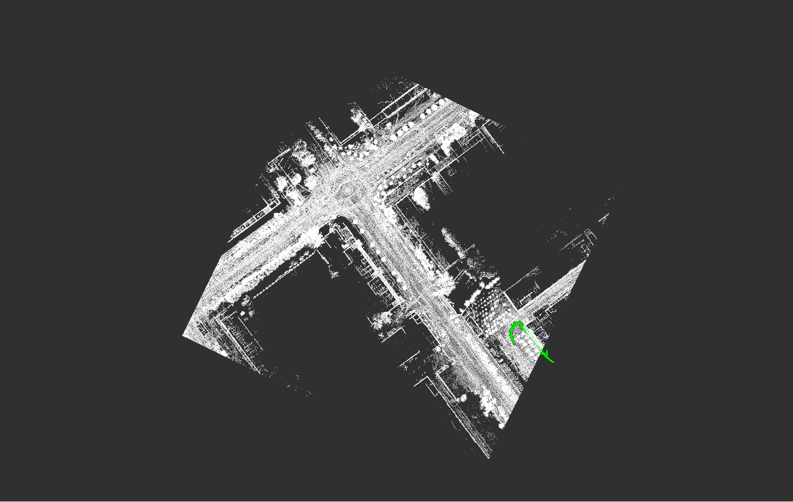
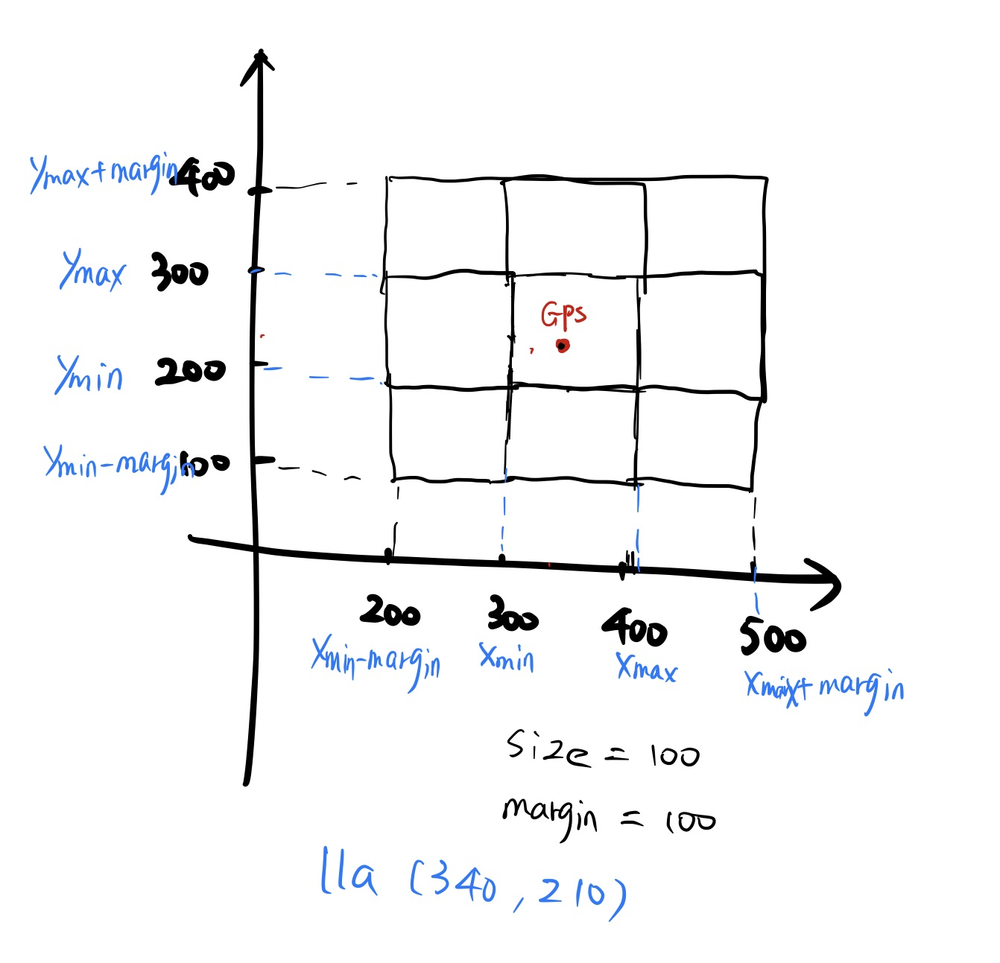
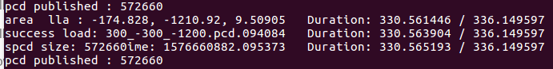

# 自动驾驶实战系列(六)——网格地图的动态加载

在第二篇中我们划分好了点云的网格地图并可视化出来，本章主要讲解点云地图的动态加载原理及实现过程，最后说明动态加载需要注意的一些问题．水平有限，难免有错误和疏漏，可在文章下方评论说明．



<!-- more-->

接上一篇，对点云地图进行网格划分

<a href="http://xchu.net/2019/10/30/32pcd-divider/"  class="LinkCard">自动驾驶实战系列(二)——点云地图划分网格并可视化</a>

## 一、主要思路

​	要实现在定位过程中动态加载相应的网格点云，需要接收当前的GPS位置，确定当前位置的网格点云，考虑当前位置在网格的边界时，我们可以预定义一个margin距离，在当前网格周围margin范围内的网格点云均为需要加载的区域．基本的原理我在下面画了一个简图．

> 举例子，当前的网格size为100米，当前汽车的XY位置为(340，210)，首先可以确定汽车当前位置所在网格左下角坐标为(300，200)，这样我们就可以很轻松得根据PCD文件名加载当前的网格点云．之后根据margin大小，以当前网格的四个顶点坐标为基准，向四周扩展margin范围，将此范围内的所有网格地图加载出来即可．如图，最多加载9块，要加载的区域是x_min-margin，x_max+margin，y_min-margin，y_max+margin
>

## 二、实现过程

由于这部分的工程基本上没什么难度，我将主要在代码注释里面加以说明

```c++
constexpr double MARGIN_UNIT = 100; // meter

gps_tools_.lla_origin_ << origin_latitude, origin_longitude, origin_altitude;//地图起点，后续lla转xyz

if (grid_size == "noupdate") //是否动态更新
    margin = -1;
else if (grid_size == "1x1")
    margin = 0;
else if (grid_size == "3x3")
    margin = MARGIN_UNIT * 1;
else if (grid_size == "5x5")
    margin = MARGIN_UNIT * 2;
else if (grid_size == "7x7")
    margin = MARGIN_UNIT * 3;
else if (grid_size == "9x9")
    margin = MARGIN_UNIT * 4;
else {
    std::cout << "grid_size 有误..." << std::endl;
    return EXIT_FAILURE;
}
```

读网格点云地图，并记录文件名

```c++
std::string front_path;

getAllFiles(area_directory, pcd_paths); //获取pcd文件
if (pcd_paths.size() == 0) {
    return EXIT_FAILURE;
}

int pos = pcd_paths[0].find_last_of('/');//获取路径前缀
std::string path_name(pcd_paths[0].substr(0, pos + 1));
front_path = path_name;

if (margin < 0) {
    can_download = false; //不在线下载
} else {
    can_download = false; //分块更新

    for (const std::string &path : pcd_paths) {
        int pos = path.find_last_of('/');
        std::string file_name(path.substr(pos + 1));
        pcd_names.push_back(file_name);
    }
}
```

pub和sub

```c++
ins_pub = n.advertise<nav_msgs::Odometry>("/gps_odom", 5, false);
pcd_pub = n.advertise<sensor_msgs::PointCloud2>("localmap", 5, true);
stat_pub = n.advertise<std_msgs::Bool>("pmap_stat", 1, true);//加载状态

stat_msg.data = false;
stat_pub.publish(stat_msg);
```

校验一下csv文件中读取到的pcd文件是否存在

```c++
if (margin < 0) {
    int err = 0;
    publish_pcd(create_pcd(pcd_paths, &err), &err); //不分块
} else {
    std::cout << "can_download... " << std::endl;

    n.param<int>("points_map_loader/update_rate", update_rate, DEFAULT_UPDATE_RATE);
    fallback_rate = update_rate * 2; 

    gnss_sub = n.subscribe("/novatel718d/pos", 5, publish_gnss_pcd); //有更新
    
    if (can_download) {
        AreaList areas = read_arealist(arealist_path); //读取csv记录的pcd文件

        for (const Area &area : areas) {
            for (const std::string &path : pcd_names) {
                if (path == area.path) {
                    // 将csv记录的并且文件夹中有的pcd文件，放进downloaded_areas中
                    cache_arealist(area, downloaded_areas);
                }
            }
    }
    gnss_time = current_time = ros::Time::now();//当前时间，以gnss为准
}
```

读取csv文件，并查找

```c++
struct Area {
    std::string path;
    double x_min;
    double y_min;
    double z_min;
    double x_max;
    double y_max;
    double z_max;
};

typedef std::vector<Area> AreaList;   
typedef std::vector<std::vector<std::string>> Tbl;
 
AreaList read_arealist(const std::string &path) {
    Tbl tbl = read_csv(path);　//逐行读取

    AreaList ret;　//用定义的area重新封装
    for (const std::vector<std::string> &cols : tbl) {
        Area area;
        area.path = cols[0];
        area.x_min = std::stod(cols[1]);
        area.y_min = std::stod(cols[2]);
        area.z_min = std::stod(cols[3]);
        area.x_max = std::stod(cols[4]);
        area.y_max = std::stod(cols[5]);
        area.z_max = std::stod(cols[6]);
        ret.push_back(area);
    }
    return ret;
}

Tbl read_csv(const std::string &path) {//逐行读取csv文件
    std::ifstream ifs(path.c_str());
    std::string line;
    Tbl ret;
    while (std::getline(ifs, line)) {
        std::istringstream iss(line);
        std::string col;
        std::vector<std::string> cols;
        while (std::getline(iss, col, ','))
            cols.push_back(col);
        ret.push_back(cols);
    }
    return ret;
}

void cache_arealist(const Area &area, AreaList &areas) {
    for (const Area &a : areas) {//没有的话加入
        if (a.path == area.path)
            return;
    }
    areas.push_back(area);
}
```

最后是根据gps位置更新，进行坐标转换

```c++
void publish_gnss_pcd(const sensor_msgs::NavSatFixPtr &gps_msg) {
    if (std::isnan(gps_msg->latitude + gps_msg->longitude + gps_msg->altitude)) {
        ROS_INFO("GPS LLA NAN...");
        return;
    }
    if (gps_msg->status.status == 4 || gps_msg->status.status == 5 || gps_msg->status.status == 1 ||
        gps_msg->status.status == 2) {

        ros::Time now = ros::Time::now();//注意更新频率是否符合预定要求
        if (((now - current_time).toSec() * 1000) < fallback_rate)
            return;
        if (((now - gnss_time).toSec() * 1000) < update_rate)
            return;
        gnss_time = now;

        Eigen::Vector3d lla = gps_tools_.GpsMsg2Eigen(*gps_msg);
        Eigen::Vector3d ecef = gps_tools_.LLA2ECEF(lla);
        Eigen::Vector3d enu = gps_tools_.ECEF2ENU(ecef);
        gps_tools_.gps_pos_ = enu;
        gps_pos_ = enu;

        geometry_msgs::Point pose;
        pose.x = gps_pos_(0);
        pose.y = gps_pos_(1);
        pose.z = gps_pos_(2);

        std::cout << "area  lla : " << gps_pos_(0) << ", " << gps_pos_(1) << ", " << gps_pos_(2)<< std::endl;
        publish_pcd(create_pcd(pose));　//pub当前的网格
}
```

根据位置去查询相应的网格地图

```c++
sensor_msgs::PointCloud2 create_pcd(const geometry_msgs::Point &p) {

    sensor_msgs::PointCloud2 pcd, part;
    std::unique_lock<std::mutex> lock(downloaded_areas_mtx);

    for (const Area &area : downloaded_areas) {//遍历一下
        if (is_in_area(p.x, p.y, area, margin)) { //判断当前位置在哪些网格里面
            std::string pcd_name = front_path + area.path;//实际的PCD文件路径

            if (pcd.width == 0)
            pcl::io::loadPCDFile(pcd_name.c_str(), pcd);
            else {
                std::cout << "success load: " << area.path << std::endl;
                pcl::io::loadPCDFile(pcd_name.c_str(), pcd);

                pcd.width += part.width;　//所有符合条件的网格全pub出来
                pcd.row_step += part.row_step;
                pcd.data.insert(pcd.data.end(), part.data.begin(), part.data.end());
            }
        }
    }
    return pcd;
}
```

判断当前位置是否在此Area里面

```c++
bool is_in_area(double x, double y, const Area &area, double m) {
    return ((area.x_min - m) <= x && x <= (area.x_max + m) && (area.y_min - m) <= y && y <= (area.y_max + m));
}
```

这里我们根据连续的GPS位置计算一个实时的yaw角，来大致观察车辆的运动轨迹．

```c++
//   pub gps odom
nav_msgs::Odometry odom;
odom.header.stamp = gnss_time;
odom.header.frame_id = "map";

odom.pose.pose.position.x = gps_pos_(0);
odom.pose.pose.position.y = gps_pos_(1);
odom.pose.pose.position.z = gps_pos_(2);

double distance = sqrt(pow(odom.pose.pose.position.y - _prev_pose.pose.position.y, 2) + pow(odom.pose.pose.position.x - _prev_pose.pose.position.x, 2));
if (distance > 0.2) {
    //返回值是此点与远点连线与x轴正方向的夹角
    yaw = atan2(odom.pose.pose.position.y - _prev_pose.pose.position.y,
    odom.pose.pose.position.x - _prev_pose.pose.position.x);
    _quat = tf::createQuaternionMsgFromYaw(yaw);
    _prev_pose = odom.pose;
}
odom.pose.pose.orientation = _quat;

odom.child_frame_id = "base_link";
odom.twist.twist.linear.x = 0.0;
odom.twist.twist.linear.y = 0.0;
odom.twist.twist.angular.z = 0.0;

ins_pub.publish(odom);
} else {
	ROS_INFO("no rtk, map stop update...");
}
```

## 三、最终效果及评价



**最终效果**

最后看一下打印出来的log，当前车辆的LLA位置为(-174.828，-1210.92，9.50905)，加载的网格地图为300_-300_-1200.pcd，由于我这里设定的网格大小为300米，margin为100米，所有只需要加载一个网格．

**总结一下**

动态加载的主要作用是大地图时减少内存空间，拿IO换内存．

> 比如10km*10km级别的地图，size为1km，一共100块网格，每次加载一块网格的话，地图占用内存就会减少到原来的1/100．

特别需要注意，如果网格size过小，划分网格太多，频繁的加载网格，IO以及内存分配会消耗大量的资源，反而会拖慢整个定位的速度，最终得不偿失．所以我们的网格size一般是1km级别的，对大地图作用明显，小地图就没有动态加载的必要了．

## 四、致谢

- Autoware.AI
- Autocore陈晨
- 一清创新RAMLAB

