 # 自动驾驶实战系列(七)——高精地图制作流程实践


​	高精地图作为一个单独的模块，给感知，规划等模块提供支持，涉及到的算法内容繁杂且工程难度较大，目前尚无太多系统性的开源代码可以参考。下图是我修改的Autoware高精地图模块的可视化效果，包含元素类别按照算法而言，我们主要可以分为以下三大类，

- 地面标志：车道线、停止线、路标等
- 空中物体：红绿灯、路灯、限速牌/路牌
- 各种灯杆、路沿、排水沟等

在这些类别中，最重要的部分是车道线、路沿、红绿灯、地标和人行横道，更多的语义类别我们后期再继续考虑。这里我将给出示例高精地图数据，可以作为单独的模块直接在catkin工作空间下编译使用。

​	本篇我们将参考Autoware VectorMap，熟悉其格式结构，并进行一定程度的修改，根据我们当前测试场地的一些元素，制作自己的高精地图。在本篇之前，需要对高精地图的概念有一定程度的了解，这部分可以参考我之前整理的几篇博客。

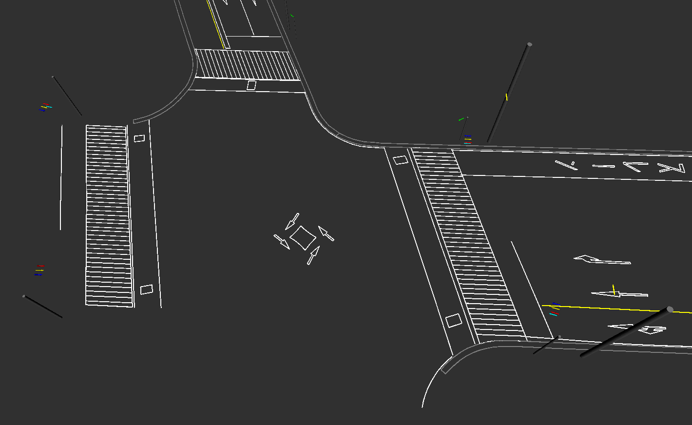
<!-- more-->
<a href="http://xchu.net/2019/09/27/HDMAP%E5%BB%BA%E5%9B%BE%E6%B5%81%E7%A8%8B/"  class="LinkCard">HDMap建图流程</a>
<a href="http://xchu.net/2019/09/28/hdmap%E5%88%86%E5%B1%82/" class="LinkCard">HDMap图层</a>
<a href="http://xchu.net/2019/08/20/apollo%E9%AB%98%E7%B2%BE%E5%9C%B0%E5%9B%BE%E6%A6%82%E8%BF%B0/"  class="LinkCard">Apollo高精地图概述</a>

## 制图流程概述

​	目前高精地图的制作是需要有测绘资质的，所以一般把握在图商手中和一些自动驾驶公司。对于园区这种非公共区域，我认为制图是没问题的。**高精地图作为一种语义地图，概括地说，就是在点云地图上，对我们所用到的元素进行分类和提取，添加语义标签，最后用一套合理的地图框架来存储并支撑其他模块的需求**。

​	高精地图制作完成后，其数据量其实是非常小的。地图数据可以存储在云端，也可以直接直接在本地，数据量大的大地图还有可以用数据库来存储。先暂且不论地图格式是Lanlet2还是Opendrive以及其他，完整的理解高精地图的元素结构，以及数据存储和使用则为重中之重，后续的格式要求可按自己的需求来修改。

**小地图手工标注方法**

​	对于3km级别以内的小地图而言，一般可以采取手工标注点云地图的方法来制图。目前我了解到的以下软件均可，比如

- `Roadrunner`

  ​	最新版可直接标注点云PCD文件，添加语义，可直接导出标准Opendrive，缺点就是目前语义类别不太完善，导出格式只支持标准Opendrive。**在使用上，高校申请免费。**

- `LGSVL模拟器`（Unity插件版，需要手动编译）

  ​	支持目前的主流地图格式，可导入导出如Apollo Opendrive/标准Opendrive/Autoware VectorMap/Lanelet2等地图，缺点是不支持直接标注点云PCD，目前只能标注LGSVL提供的一些虚拟环境，使用上是完全开源的。

  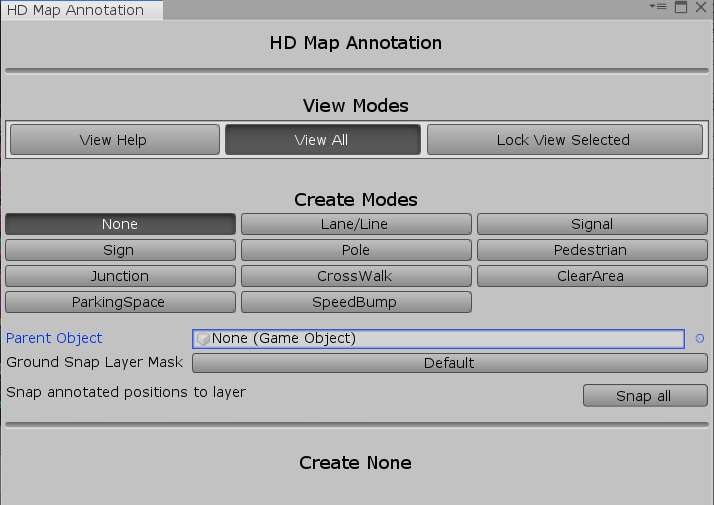

- ` Autocore MapToolBox`插件

  AutoCore提供的开源工具，用于标注生成Autoware矢量地图，更新速度极快，目前可标注车道线，路沿，红绿灯，即将全面支持Lanelet2 ，项目完全开源，本篇将着重讲解。
  
- `51VR等地图服务提供商（收费）`

  一般直接提供标注软件及相关配套商业服务，成本较大。
  
  ...
  

**地图格式规范差异**

​	值得注意的是，目前各家地图格式规范基本都不是统一的，自动驾驶公司、图商、仿真软件公司等在地图格式标准上有一定的差异。以车道在高精地图中的存储为例，自动驾驶公司偏向于以坐标序列来存储，比如Apollo OpenDrvie和Autoware，部分图商和仿真软件公司又偏向于以传统的曲线方程的形式存储，比如Carla等**自动驾驶仿真器只支持标准Opendrive**。

​	对于规划器和控制器而言，方程式表达的更利于规划和控制，坐标序列表达当然也可以，这一点非主要问题，开源可以参考的方法相当多。但在各种地图格式的转换中，**必然会损失一些信息**，比如围栏、排水沟等复杂元素的表达，但主要的车道，车道线，路标等基本元素信息还在。

## 制图流程实践

### 构建点云底图	

构建点云地图可以用一些主流的激光SLAM算法来完成，比如LOAM系列（ALOAM/VLOAM/LEGO-LOAM），可以去KITTI Odometry排行榜上查找排行前列的一些算法。注意我们需要构建的是，比如LOAM系列，也可以参考我的第一篇博客：

<a href="http://xchu.net/2019/10/11/31ndt-map/"  class="LinkCard">自动驾驶实战系列(一)——利用NDT算法构建点云地图</a>

这里需要注意的是，底图目前建议使用**稠密地图，并且是拼接关键帧而成**（非特征点地图），还需要有强度信息，这样使得纹理效果更明显，方便标注。如下图是velodyne 16线激光雷达构建的稠密点云地图，地标和车道线还算明显，建议还是**需要用高线束激光雷达建图**。

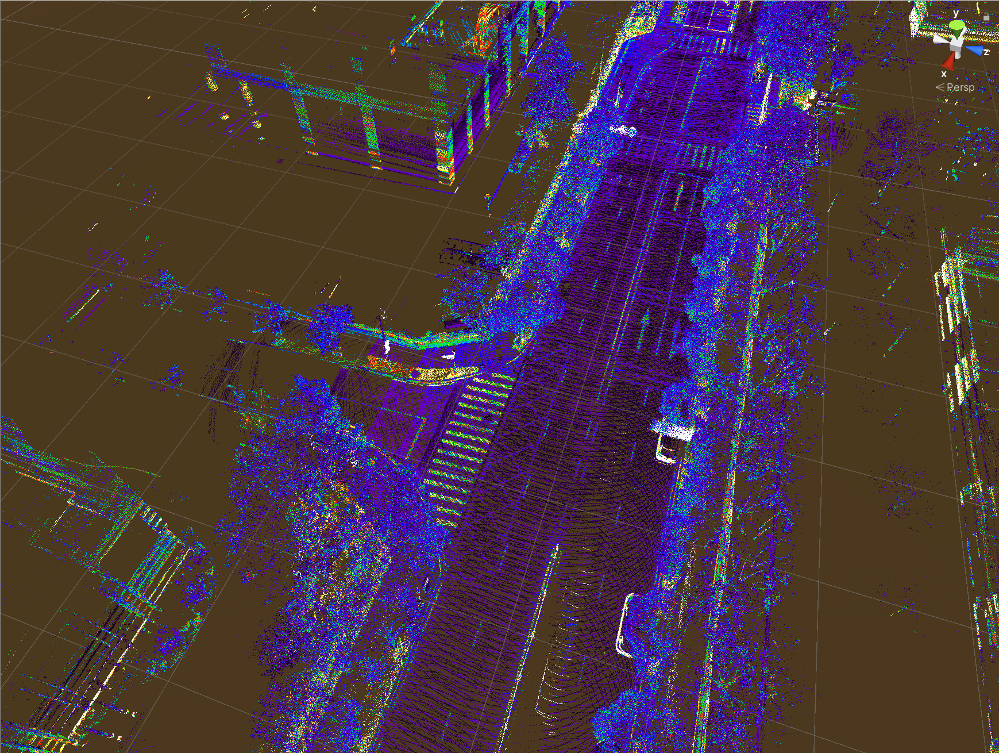

这里挖个坑，把LEGO-LOAM构建点云地图的代码贴出来：

...

### 点云地图标注

#### 自动标注

​	因为自动标注的方法目前步骤繁琐，难度较大，涉及到的算法相当的复杂并且效果各异，对于一般的小团队而言，不太现实。目前我本人也正在研究这部分的工作，在精力和时间允许的情况下，后续的博客主要也是集中在这一块。

​	自动标注涉及到的算法相当多，流程大致如下：

1.  点云地图提取路面GroundExtraction（强度图、密度图、高程图）
2. 路面部分提取路沿、车道线、各种路标、停止线、人行横道等。（各种多层强度阈值过滤方法）
3. 非路面部分提取路牌，红绿灯，路灯，灯杆等。（可配合视觉来分割）
4. 对每一类的线段部分分别进行分段直线/曲线拟合，有序保留端点和均匀的采样点，按位置进行排序。将有序的线段再次分类，比如左车道线，右车道线，中心线（可根据直线截距或者斜率阈值过滤），计算同一条车道线的各段线段的方向，连接端点，完成**矢量化**。
5. 对每一类的多边形部分，比如路标，进行轮廓计算，从点云轮廓中提取出矩形或者箭头端点，按逆时针/顺时针存储（有内外圈的区分）。
6. 分别拿视觉检测出来的车道线点，通过内参->外参参转换到世界坐标系下，去补充激光提取出来的不完整的部分。
7. 用Lanelet2等地图框架，根据之前的各种点云分类，添加语义及车道的关联关系，构建地图索引和数据存储，生成高精地图数据文件，后面的博客有介绍Lanelet2用法。
8.  用地图编辑软件打开地图并手工修正相应的轮廓，或者补充缺失部分。

**自动标注方法可以参考我解析的两篇paper**

<a href="http://xchu.net/2020/02/27/43hdmap-creation/"  class="LinkCard">Machine Learning Assisted High-Definition Map Creation</a>

<a href="http://xchu.net/2020/03/11/44roadinfo-extraction/"  class="LinkCard">Automated Road Markings Extraction ,Classification and vetorization From Mobile Laser Scanning Data</a>

​	对于小团队而言，手工标注比较合适，优势在于手工标注基本不会有遗漏，缺点就是工作量较大，依赖于标注软件，可能会有一些人为标注错误，需要做严格的质量校验。不管是自动标注或者手工标注的方法，都需要标注软件去，因为目前而言机器算法无法做到百分之百，而且实际的道路由于路标遮挡、磨损等原因，**都需要使用标注软件去手工修正**。一个功能强大的标注软件是高精地图生态必不可少的一部分。

#### 手工标注

​	这里我们采用Autoware的地图标注插件，Unity + MapToolBox进行标注，插件地址如下：`https://github.com/autocore-ai/MapToolbox`

​	这里注意下载的Unity版本需2019.3+，插件使用方式在youtube上搜索`Vector Map Autocore ` 即可找到详细的视频介绍。标注完成的都是有序的点云，这个对比自动提取的算法而言非常方便。这之后会生成一系列的cvs文件，这些就是高精地图的数据文件，格式参考Lanelets。

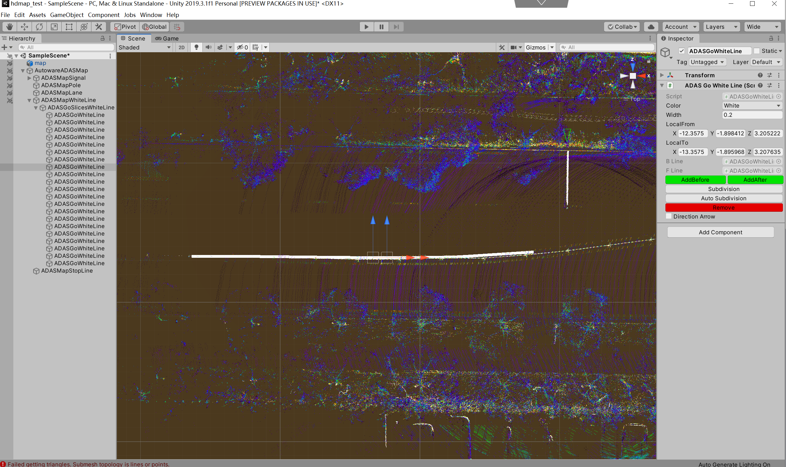

这个插件老版本的效果如下：

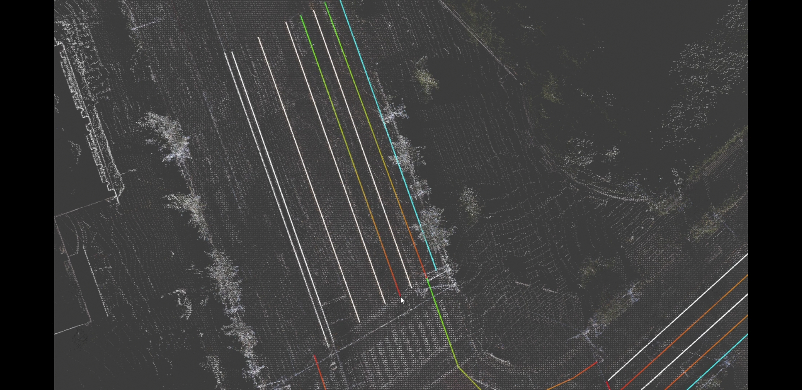

开发者标注完成的一部分地图，包含车道线、路沿、停止线、人行横道、交通灯、车道。


我自己粗略的标注了楼下的一段路口，只有车道线，效果如下：

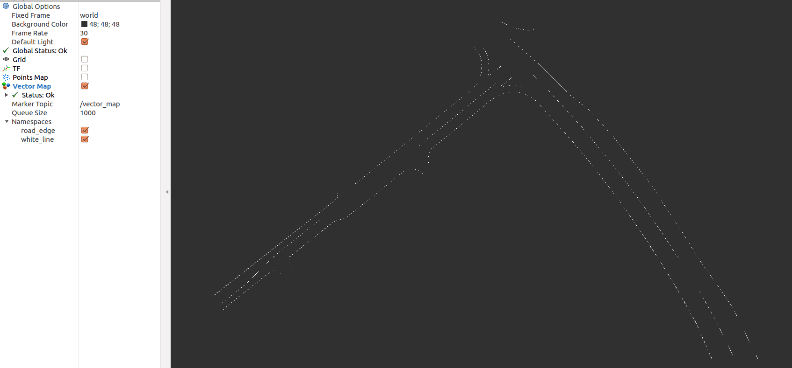

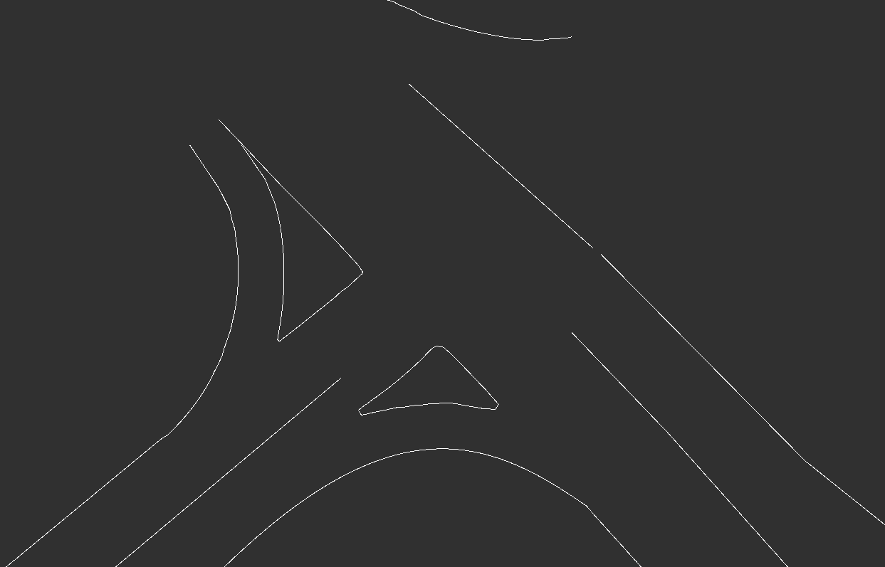

#### 制作Apollo Opendrive地图	

目前私信我问的最多的问题是如何制作Apollo或者Autoware上可用的高精地图。本篇主要讲解了如何制作Autoware高精地图，对于Apollo Opendrive高精地图的话，我也有一些思路提供在下面。

- 可以根据上面Autoware开源的MapToolbox，这俩都是C#项目，前者可以改写后端，存储标准点的时候按照Apollo Opendrive的格式去存。都是坐标序列描述，改写难度应该不大。

- 改写LGSVL模拟器的地图标注部分，使之支持直接导入PCD点云，可直接生成Apollo Opendrvie地图。

- 利用RoadRunner标准点云PCD，导出标准Opendrive地图，采用LGSVL模拟器将标准Opendrive转换到Apollo Opendrive地图。此步骤已验证，示例标注的Apollo Opendrive地图如下

  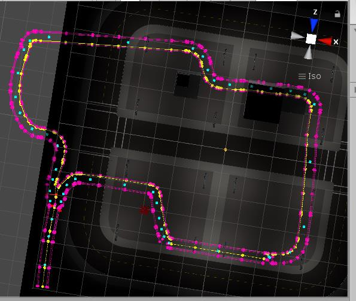

- 由于目前支撑Opendrive的开源lib库很少，可以利用其他的开源地图框架，生成高精地图之后再转换为Apollo Opendrive格式。这里目前可选择的仅仅是Liblanelets/Lanlets2，按照Lanlets2的接口规范可以生成OSM地图，在用开源的JSOM编辑器编辑完OSM地图后，再转换成Apollo Opendrive地图，一步转换流程有开源的代码可以参考，测试效果如下图所示，第一张是Lanelet2地图，第二张是转换之后的标准opendrive地图。可以看到此套代码，目前主要是就车道部分进行了转换，其他元素暂未考虑，不过主要问题已经解决了，修改下转换代码，将车道部分在曲线上采样，即可从标准Opendrive转换到Apollo Opendrive。

> https://github.com/JHMeusener/osm2xodr.git

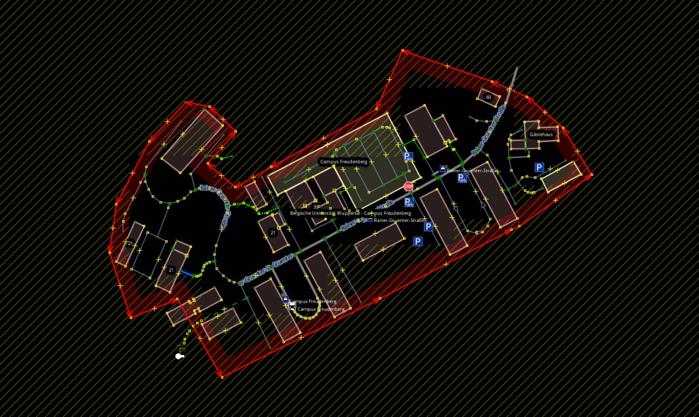

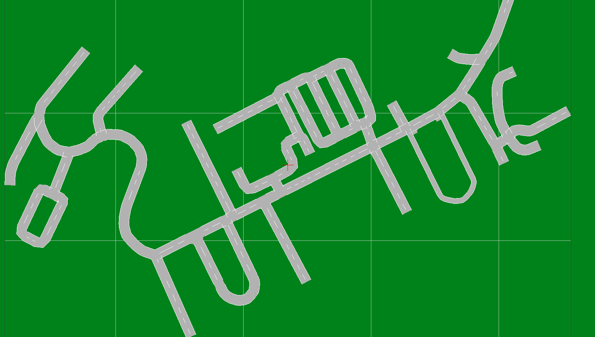

### 地图数据存储

Autoware的矢量地图元素的数据结构定义是参考liblanelet设计的，这里示例的高精地图是通过csv来存储的，可类比关系型数据库。其中

- `vector_map::Point`类型是最底层的结构，point.csv文件里面按顺序存储了高精地图中所有的点的空间位置，世界坐标/经纬高，每个点对应唯一的id供其他元素引用。
- `vector_map::Vector`格式则是来描述向量数据，可以理解成两/三个点+方向，比如红绿灯、路灯等。vector.csv文件是存储这些矢量及其相关联的Point.
- `vector_map::Line`则为最重要的，可以用来描述车道线、停止线、路标、人行横道、斑马区等等元素,存于line.csv中,两个point的连线即为line
- `vector_map::Pole`则是在vector基础上组织的结构，用于描述所有和杆相关的,比如红绿灯杆,路灯杆,路牌杆等，存于pole.csv文件中。

这里简单说了下集中结构，下一部分会详细解析其他结构。Autoware里面的元素分类还是比较多的。

```xml
point.csv
vector.csv
line.csv
area.csv
pole.csv
box.csv
dtlane.csv
node.csv
lane.csv
wayarea.csv
roadedge.csv
gutter.csv
curb.csv
whiteline.csv
stopline.csv
zebrazone.csv
crosswalk.csv
road_surface_mark.csv
poledata.csv
roadsign.csv
signaldata.csv
streetlight.csv
utilitypole.csv
guardrail.csv
sidewalk.csv
driveon_portion.csv
intersection.csv
sidestrip.csv
curvemirror.csv
wall.csv
fence.csv
railroad_crossing.csv
```

## 元素格式定义及RVIZ可视化实现

这里我们对整个高精地图的数据组织形式做一个简单的说明。

> 将点云进行分类和下采样完成后,把所有的点按照我们定义的类型重新组织，其中point每个点进行唯一编号，包含经纬高blh和平面xy坐标。之后根据分类好的元素，按照line、vector、area分别组织数据。

### 通用形状实现

矢量地图本身就是用点、矢量线段、多边形来描述地图元素，在rviz中可视化的时候,我们一般用`visualization_msgs::Marker`来表示，对应的marker中的形状类型有`SPHERE`(球体)，`ARROW`(箭头)，LINE_STRIP(线段)和CYLINDER(圆柱体).这里我们来做一些通用的定义。这里的position和orientation、scale放在后续具体的元素中来定义。

```c++
visualization_msgs::Marker createMarker(const std::string &ns, int id, int type) {
    visualization_msgs::Marker marker;
    // NOTE: we want to use map messages with or without /use_sim_time.
    // Therefore we don't set marker.header.stamp.
    // marker.header.stamp = ros::Time::now();
    marker.header.frame_id = "map";
    marker.ns = ns;
    marker.id = id;
    marker.type = type;
    marker.lifetime = ros::Duration();
    marker.frame_locked = true;
    disableMarker(marker); //action:delete
    return marker;
}
```

`disableMarker`表示marker的action

```c++
void enableMarker(visualization_msgs::Marker &marker) {
    marker.action = visualization_msgs::Marker::ADD;
}

void disableMarker(visualization_msgs::Marker &marker) {
    marker.action = visualization_msgs::Marker::DELETE;
}

bool isValidMarker(const visualization_msgs::Marker &marker) {
    return marker.action == visualization_msgs::Marker::ADD;
}
```

**后续所有的点都用utm坐标来描述，这里做一个转换**

```c++
double convertDegreeToRadian(double degree) {
        return degree * M_PI / 180;
    }

double convertRadianToDegree(double radian) {
    return radian * 180 / M_PI;
}

//  将点转化成geometry_msgs::Point类型,坐标还是用平面坐标描述
geometry_msgs::Point convertPointToGeomPoint(const Point &point) {
    geometry_msgs::Point geom_point;
    // NOTE: Autwoare use Japan Plane Rectangular Coordinate System.
    // Therefore we swap x and y axis.
    geom_point.x = point.ly;
    geom_point.y = point.bx;
    geom_point.z = point.h;
    return geom_point;
}

Point convertGeomPointToPoint(const geometry_msgs::Point &geom_point) {
    Point point;
    // NOTE: Autwoare use Japan Plane Rectangular Coordinate System.
    // Therefore we swap x and y axis.
    point.bx = geom_point.y;
    point.ly = geom_point.x;
    point.h = geom_point.z;
    return point;
}

geometry_msgs::Quaternion convertVectorToGeomQuaternion(const Vector &vector) {
    double pitch = convertDegreeToRadian(vector.vang - 90); // convert vertical angle to pitch 垂直角度
    double yaw = convertDegreeToRadian(-vector.hang + 90); // convert horizontal angle to yaw 水平角度
    return tf::createQuaternionMsgFromRollPitchYaw(0, pitch, yaw);
}

Vector convertGeomQuaternionToVector(const geometry_msgs::Quaternion &geom_quaternion) {
    tf::Quaternion quaternion(geom_quaternion.x, geom_quaternion.y, geom_quaternion.z, geom_quaternion.w);
    double roll, pitch, yaw;
    tf::Matrix3x3(quaternion).getRPY(roll, pitch, yaw);
    Vector vector;
    vector.vang = convertRadianToDegree(pitch) + 90;
    vector.hang = -convertRadianToDegree(yaw) + 90;
    return vector;
}
```

### 基本格式

#### Idx

csv文件编号，用来统计数据文件序号，无用

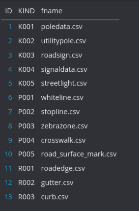

#### Point

记录所有的点云的blh和xy值 ，并用pid唯一编号，这里xy为utm坐标值（当然也可以是enu坐标），后面几个字段意义不明显，为保留字段。

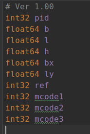

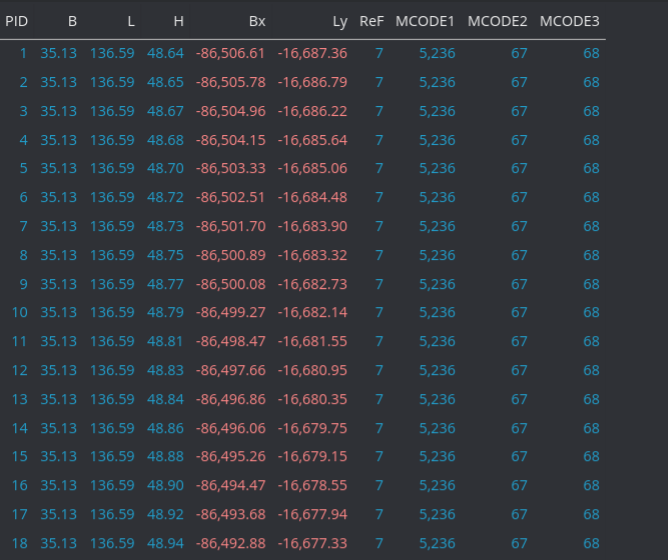

可视化时,我们用球体来表示point

```c++
visualization_msgs::Marker createPointMarker(const std::string &ns, int id, Color color, const Point &point) {
    visualization_msgs::Marker marker = createMarker(ns, id, visualization_msgs::Marker::SPHERE);
    if (point.pid == 0) //pid>0
    return marker;

    marker.pose.position = convertPointToGeomPoint(point);//position用平面坐标来描述
    marker.pose.orientation = convertVectorToGeomQuaternion(Vector());//方向用矢量描述
    marker.scale.x = MAKER_SCALE_POINT;
    marker.scale.y = MAKER_SCALE_POINT;
    marker.scale.z = MAKER_SCALE_POINT;
    marker.color = createColorRGBA(color);
    if (marker.color.a == COLOR_VALUE_MIN)
    return marker;

    enableMarker(marker);
    return marker;
}
```

#### Vector

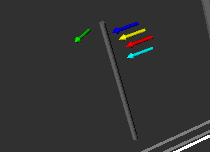

用vid唯一标志 ，vector表示矢量，即有方向，就是当前点到原点的向量，其中hang和vang分别表示此矢量的水平角度和垂直角度和姿态之间的转换关系．在marker中一般用箭头来描述，用来表示红绿灯等元素。

```
hang=90-yaw
vang=pitch+90
```

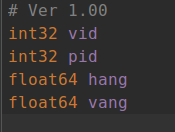

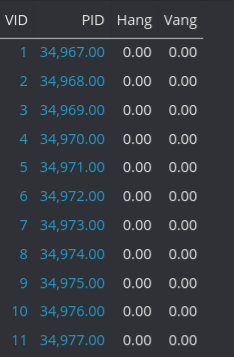
```c++
visualization_msgs::Marker createVectorMarker(const std::string &ns, int id, Color color, const VectorMap &vmap, const Vector &vector) {
    visualization_msgs::Marker marker = createMarker(ns, id, visualization_msgs::Marker::ARROW);//箭头
    if (vector.vid == 0)
        return marker;

    Point point = vmap.findByKey(Key<Point>(vector.pid));//找到终点
    if (point.pid == 0)
        return marker;

    marker.pose.position = convertPointToGeomPoint(point);
    marker.pose.orientation = convertVectorToGeomQuaternion(vector);
    marker.scale.x = MAKER_SCALE_VECTOR_LENGTH;
    marker.scale.y = MAKER_SCALE_VECTOR;
    marker.scale.z = MAKER_SCALE_VECTOR;
    marker.color = createColorRGBA(color);
    if (marker.color.a == COLOR_VALUE_MIN)
        return marker;

    enableMarker(marker);
    return marker;
}
```

#### Line

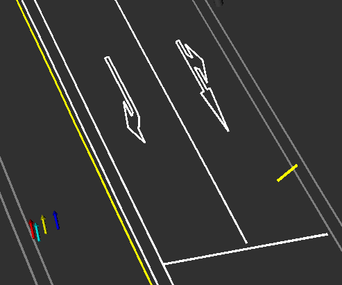

line表示线段，图中的黄线，白线，路沿均以此来描述，用lid来唯一标志，bpid和fpid指的是连线的两个端点的id,blid和flid表示线段之间的关联关系,分别是上一条和下一条线段的lid，若blid=0的话需要设定起点，flid是其关联的下一条线的id。

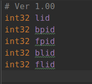

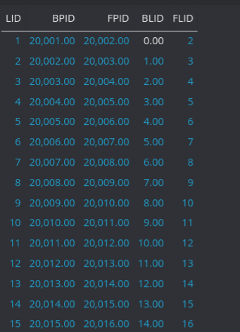

```c++
 visualization_msgs::Marker createLineMarker(const std::string &ns, int id, Color color, const VectorMap &vmap, const Line &line) {
     visualization_msgs::Marker marker = createMarker(ns, id, visualization_msgs::Marker::LINE_STRIP);//线带
     if (line.lid == 0)
         return marker;

     Point bp = vmap.findByKey(Key<Point>(line.bpid));//找到起点和终点,相邻点连线
     if (bp.pid == 0)
         return marker;

     Point fp = vmap.findByKey(Key<Point>(line.fpid));
     if (fp.pid == 0)
         return marker;

     marker.points.push_back(convertPointToGeomPoint(bp));
     marker.points.push_back(convertPointToGeomPoint(fp));

     marker.scale.x = MAKER_SCALE_LINE;
     marker.color = createColorRGBA(color);
     if (marker.color.a == COLOR_VALUE_MIN)
         return marker;

     enableMarker(marker);
     return marker;
 }
```


#### Area

area用来描述区域,由连续的按顺序排列的线段组成,其中aid是其唯一标识,slid和elid分别为当前area的start_line和end_line的id,中间的线段按顺序查找line的关联id即可.

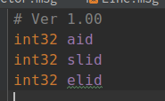

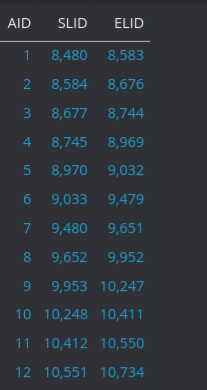

```c++
 visualization_msgs::Marker createAreaMarker(const std::string &ns, int id, Color color, const VectorMap &vmap, const Area &area) {
     visualization_msgs::Marker marker = createMarker(ns, id, visualization_msgs::Marker::LINE_STRIP);
     if (area.aid == 0)
         return marker;

     Line line = vmap.findByKey(Key<Line>(area.slid)); // line id 找到line
     if (line.lid == 0)
         return marker;
     if (line.blid != 0) // must set beginning line
         return marker;

     while (line.flid != 0) {//从这条线开始,找到所有的关联的线
         Point bp = vmap.findByKey(Key<Point>(line.bpid));
         if (bp.pid == 0)
             return marker;

         Point fp = vmap.findByKey(Key<Point>(line.fpid));
         if (fp.pid == 0)
             return marker;

         marker.points.push_back(convertPointToGeomPoint(bp));
         marker.points.push_back(convertPointToGeomPoint(fp));

         line = vmap.findByKey(Key<Line>(line.flid));//寻找其相关联的下一条线段的id
         if (line.lid == 0)
             return marker;
     }

     // 最后一根线的两点
     Point bp = vmap.findByKey(Key<Point>(line.bpid));
     if (bp.pid == 0)
         return marker;

     Point fp = vmap.findByKey(Key<Point>(line.fpid));
     if (fp.pid == 0)
         return marker;

     marker.points.push_back(convertPointToGeomPoint(bp));
     marker.points.push_back(convertPointToGeomPoint(fp));

     marker.scale.x = MAKER_SCALE_AREA;
     marker.color = createColorRGBA(color);
     if (marker.color.a == COLOR_VALUE_MIN)
         return marker;

     enableMarker(marker);
     return marker;
 }
```

#### Pole

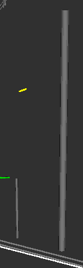

ploe用来表示杆，杆也有多种分类，比如路灯杆、交通灯杆和路牌杆，在marker中用圆柱体来描述。plid指pole的唯一id，vid指pole对应的vector id，length指pole的高度，dim指pole的底面圆半径

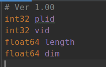

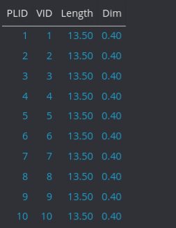

```c++
 visualization_msgs::Marker createPoleMarker(const std::string &ns, int id, Color color, const VectorMap &vmap,const Pole &pole) {
     visualization_msgs::Marker marker = createMarker(ns, id, visualization_msgs::Marker::CYLINDER);//圆柱
     if (pole.plid == 0)
         return marker;
     // XXX: The following conditions are workaround for pole.csv of Nagoya University's campus.
     if (pole.length == 0 || pole.dim == 0)
         return marker;

     Vector vector = vmap.findByKey(Key<Vector>(pole.vid));//
     if (vector.vid == 0)
         return marker;
     // XXX: The visualization_msgs::Marker::CYLINDER is difficult to display other than vertical pole.
     if (vector.vang != 0) //不垂直
         return marker;

     Point point = vmap.findByKey(Key<Point>(vector.pid));
     if (point.pid == 0)
         return marker;

     geometry_msgs::Point geom_point = convertPointToGeomPoint(point);
     geom_point.z += pole.length / 2;
     marker.pose.position = geom_point;
     vector.vang -= 90;
     marker.pose.orientation = convertVectorToGeomQuaternion(vector);
     marker.scale.x = pole.dim;
     marker.scale.y = pole.dim;
     marker.scale.z = pole.length;
     marker.color = createColorRGBA(color);
     if (marker.color.a == COLOR_VALUE_MIN)
         return marker;

     enableMarker(marker);
     return marker;
 }
```

#### Box

因为还未见过可视化的样子,目测是底面四个顶点+高度描述.


```c++
 visualization_msgs::Marker createBoxMarker(const std::string &ns, int id, Color color, const VectorMap &vmap, const Box &box) {
     visualization_msgs::Marker marker = createMarker(ns, id, visualization_msgs::Marker::LINE_STRIP);
     if (box.bid == 0)
         return marker;

     Point p1 = vmap.findByKey(Key<Point>(box.pid1));
     if (p1.pid == 0)
         return marker;

     Point p2 = vmap.findByKey(Key<Point>(box.pid2));
     if (p2.pid == 0)
         return marker;

     Point p3 = vmap.findByKey(Key<Point>(box.pid3));
     if (p3.pid == 0)
         return marker;

     Point p4 = vmap.findByKey(Key<Point>(box.pid4));
     if (p4.pid == 0)
         return marker;

     std::vector <geometry_msgs::Point> bottom_points(4);//底面四个顶点
     bottom_points[0] = convertPointToGeomPoint(p1);
     bottom_points[1] = convertPointToGeomPoint(p2);
     bottom_points[2] = convertPointToGeomPoint(p3);
     bottom_points[3] = convertPointToGeomPoint(p4);

     std::vector <geometry_msgs::Point> top_points(4);//上面四个顶点
     for (size_t i = 0; i < 4; ++i) {
         top_points[i] = bottom_points[i];
         top_points[i].z += box.height;
     }

     // ?
     for (size_t i = 0; i < 4; ++i) {
         marker.points.push_back(bottom_points[i]);
         marker.points.push_back(top_points[i]);
         marker.points.push_back(top_points[i]);
         if (i != 3) {
             marker.points.push_back(top_points[i + 1]);
             marker.points.push_back(top_points[i + 1]);
             marker.points.push_back(bottom_points[i + 1]);
         } else {
             marker.points.push_back(top_points[0]);
             marker.points.push_back(top_points[0]);
             marker.points.push_back(bottom_points[0]);
         }
     }
     for (size_t i = 0; i < 4; ++i) {
         marker.points.push_back(bottom_points[i]);
         if (i != 3)
             marker.points.push_back(bottom_points[i + 1]);
         else
             marker.points.push_back(bottom_points[0]);
     }

     marker.scale.x = MAKER_SCALE_BOX;
     marker.color = createColorRGBA(color);
     if (marker.color.a == COLOR_VALUE_MIN)
         return marker;

     enableMarker(marker);
     return marker;
 }
```

#### Node

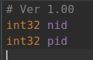


#### Lane

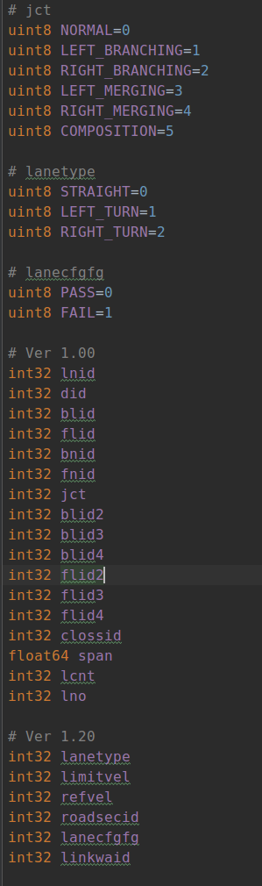

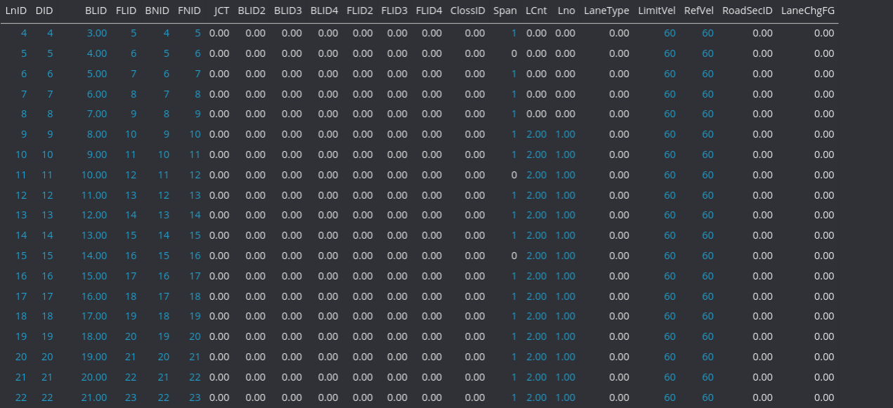

#### Dtlane

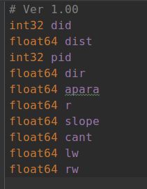

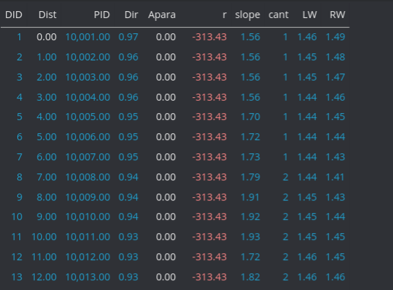

### 主要元素

目前考虑以下元素

```c++
white line //车道线 黄线/白线/实线/虚线
stop line　// 人行横道,交叉路口前的停止线

crosswalk　　//人行横道
zebra zone //斑马线区域

road mark　// 地面的路标
road sign　//道路指向　路牌
    
road pole　//　信号灯杆
signal //　信号灯
    
curb    //道路边界    
gutter  //排水沟
road edge　//道路边界缺口部分

streetlight //路灯
utility ploe　//电线杆
```

#### white line

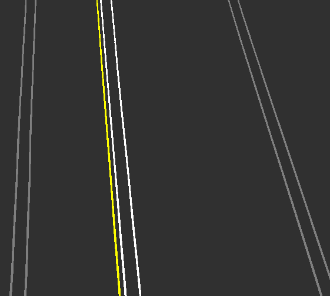

车道线类型包括实线、空心虚线、实心虚线，颜色有白色和黄色，在rviz中用LINE_STRIP来描述.

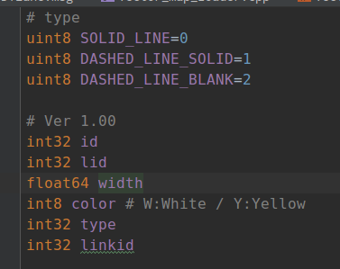

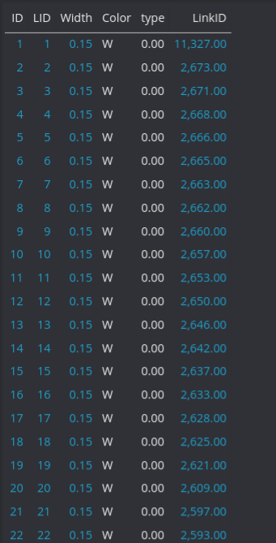

```c++
  visualization_msgs::MarkerArray createWhiteLineMarkerArray(const VectorMap &vmap, Color white_color, Color yellow_color) {
    visualization_msgs::MarkerArray marker_array;
    int id = 0;
    for (const auto &white_line : vmap.findByFilter([](const WhiteLine &white_line) { return true; })) {
        if (white_line.lid == 0) { //line无效
           ROS_ERROR_STREAM("[createWhiteLineMarkerArray] invalid white_line: " << white_line);
          continue;
          }
        if (white_line.type == WhiteLine::DASHED_LINE_BLANK) // if invisible line 空心虚线
           continue;

        Line line = vmap.findByKey(Key<Line>(white_line.lid));//找到起始的第一条线
        if (line.lid == 0) {//确认lid>0
            ROS_ERROR_STREAM("[createWhiteLineMarkerArray] invalid line: " << line);
            continue;
        }

        if (line.blid == 0) // if beginning line 找到后续的线
        {
            visualization_msgs::Marker marker;
            switch (white_line.color) {//颜色有白线和黄线,黄线表示两侧的车辆反向
                case 'W':
                    marker = createLinkedLineMarker("white_line", id++, white_color, vmap, line);
                    break;
                case 'Y':
                    marker = createLinkedLineMarker("white_line", id++, yellow_color, vmap, line);
                    break;
                default:
                    ROS_ERROR_STREAM("[createWhiteLineMarkerArray] unknown white_line.color: " << white_line);
                    continue;
            }
            // XXX: The visualization_msgs::Marker::LINE_STRIP is difficult to deal with white_line.width.
            if (isValidMarker(marker)) //add 
                marker_array.markers.push_back(marker);
            else
                ROS_ERROR_STREAM("[createWhiteLineMarkerArray] failed createLinkedLineMarker: " << line);
            }
        }
        return marker_array;
    }
```

#### stopline

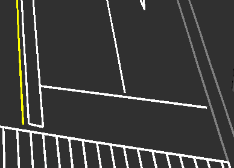

id是stop line的唯一标志,stopline也是用line来描述,rviz中是LINE_STRIP.其中lid指对应的line id,这里我们如何创建一条stop_line,并在rviz中观察到上图的可视化效果呢?

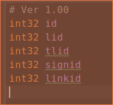

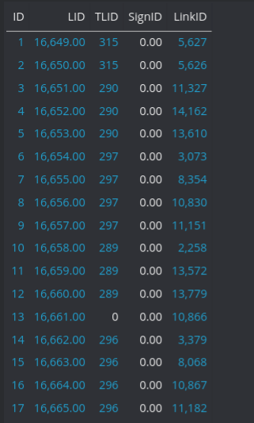
```c++
visualization_msgs::MarkerArray createStopLineMarkerArray(const VectorMap &vmap, Color color) {
    visualization_msgs::MarkerArray marker_array;
    int id = 0;
    for (const auto &stop_line : vmap.findByFilter([](const StopLine &stop_line) { return true; })) {
        if (stop_line.lid == 0) {
            ROS_ERROR_STREAM("[createStopLineMarkerArray] invalid stop_line: " << stop_line);
            continue;
        }
//根据每一条stop_line对应line 的id查找相应的line
        Line line = vmap.findByKey(Key<Line>(stop_line.lid));
        if (line.lid == 0) {//line id > 0
            ROS_ERROR_STREAM("[createStopLineMarkerArray] invalid line: " << line);
            continue;
        }

        if (line.blid == 0) // if beginning line 是第一条line,后续的line是相互关联的
        {
            visualization_msgs::Marker marker = createLinkedLineMarker("stop_line", id++, color, vmap, line);//显示每条线
            if (isValidMarker(marker))
                marker_array.markers.push_back(marker);
            else
                ROS_ERROR_STREAM("[createStopLineMarkerArray] failed createLinkedLineMarker: " << line);
        }
    }
    return marker_array;
}
```

#### road mark

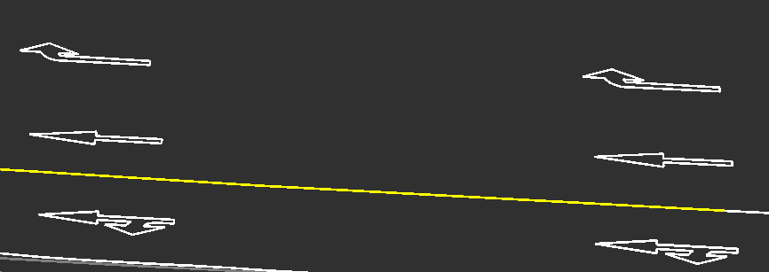

路标有四种类型，arrow、mark、character、sign,最终也是通过area来描述

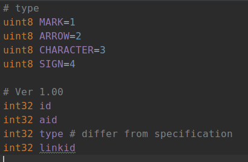

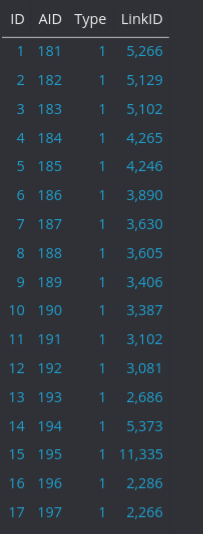
```c++
 visualization_msgs::MarkerArray createRoadMarkMarkerArray(const VectorMap &vmap, Color color) {
        visualization_msgs::MarkerArray marker_array;
        int id = 0;
        for (const auto &road_mark : vmap.findByFilter([](const RoadMark &road_mark) { return true; })) {
            if (road_mark.aid == 0) {
                ROS_ERROR_STREAM("[createRoadMarkMarkerArray] invalid road_mark: " << road_mark);
                continue;
            }

            Area area = vmap.findByKey(Key<Area>(road_mark.aid));
            if (area.aid == 0) {
                ROS_ERROR_STREAM("[createRoadMarkMarkerArray] invalid area: " << area);
                continue;
            }

            visualization_msgs::Marker marker = createAreaMarker("road_mark", id++, color, vmap, area);
            if (isValidMarker(marker))
                marker_array.markers.push_back(marker);
            else
                ROS_ERROR_STREAM("[createRoadMarkMarkerArray] failed createAreaMarker: " << area);
        }
        return marker_array;
    }
```

#### cross walk

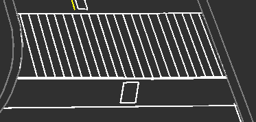

人行横道有三种类型,闭合线,条纹图案和自行车道.cross walk一般也用area来描述,aid是cross_walk的唯一标志,type表示cross walk的类型,

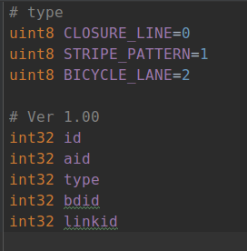

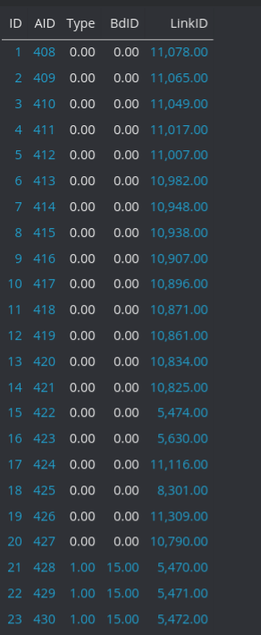

```c++
 visualization_msgs::MarkerArray createCrossWalkMarkerArray(const VectorMap &vmap, Color color) {
        visualization_msgs::MarkerArray marker_array;
        int id = 0;
        for (const auto &cross_walk : vmap.findByFilter([](const CrossWalk &cross_walk) { return true; })) {
            if (cross_walk.aid == 0) {
                ROS_ERROR_STREAM("[createCrossWalkMarkerArray] invalid cross_walk: " << cross_walk);
                continue;
            }

            Area area = vmap.findByKey(Key<Area>(cross_walk.aid));//通过aid寻找area
            if (area.aid == 0) {
                ROS_ERROR_STREAM("[createCrossWalkMarkerArray] invalid area: " << area);
                continue;
            }

            visualization_msgs::Marker marker = createAreaMarker("cross_walk", id++, color, vmap, area);
            if (isValidMarker(marker))
                marker_array.markers.push_back(marker);
            else
                ROS_ERROR_STREAM("[createCrossWalkMarkerArray] failed createAreaMarker: " << area);
        }
        return marker_array;
    }
```

#### zebra zone

依然用area描述

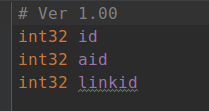


```c++
 visualization_msgs::MarkerArray createZebraZoneMarkerArray(const VectorMap &vmap, Color color) {
        visualization_msgs::MarkerArray marker_array;
        int id = 0;
        for (const auto &zebra_zone : vmap.findByFilter([](const ZebraZone &zebra_zone) { return true; })) {
            if (zebra_zone.aid == 0) {
                ROS_ERROR_STREAM("[createZebraZoneMarkerArray] invalid zebra_zone: " << zebra_zone);
                continue;
            }

            Area area = vmap.findByKey(Key<Area>(zebra_zone.aid));
            if (area.aid == 0) {
                ROS_ERROR_STREAM("[createZebraZoneMarkerArray] invalid area: " << area);
                continue;
            }

            visualization_msgs::Marker marker = createAreaMarker("zebra_zone", id++, color, vmap, area);
            if (isValidMarker(marker))
                marker_array.markers.push_back(marker);
            else
                ROS_ERROR_STREAM("[createZebraZoneMarkerArray] failed createAreaMarker: " << area);
        }
        return marker_array;
    }
```

#### road sign　

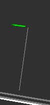

表示道路上带杆的方向指示牌,方向用vector描述,杆用pole表示,一般有两种类型,一个是停止标志,另一个是NULL

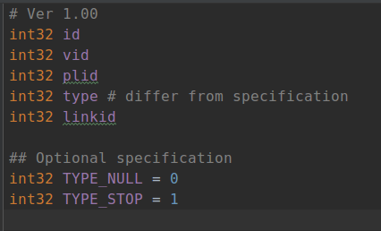

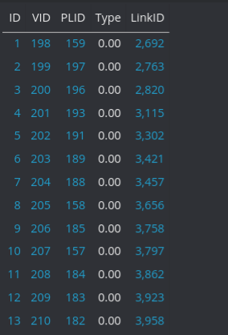

```c++
 visualization_msgs::MarkerArray  createRoadSignMarkerArray(const VectorMap &vmap, Color sign_color, Color pole_color) {
        visualization_msgs::MarkerArray marker_array;
        int id = 0;
        for (const auto &road_sign : vmap.findByFilter([](const RoadSign &road_sign) { return true; })) {
            if (road_sign.vid == 0) {
                ROS_ERROR_STREAM("[createRoadSignMarkerArray] invalid road_sign: " << road_sign);
                continue;
            }
//找到vector
            Vector vector = vmap.findByKey(Key<Vector>(road_sign.vid));
            if (vector.vid == 0) {
                ROS_ERROR_STREAM("[createRoadSignMarkerArray] invalid vector: " << vector);
                continue;
            }
//找到pole
            Pole pole;
            if (road_sign.plid != 0) {
                pole = vmap.findByKey(Key<Pole>(road_sign.plid));
                if (pole.plid == 0) {
                    ROS_ERROR_STREAM("[createRoadSignMarkerArray] invalid pole: " << pole);
                    continue;
                }
            }
//创建vector箭头
            visualization_msgs::Marker vector_marker = createVectorMarker("road_sign", id++, sign_color, vmap, vector);
            if (isValidMarker(vector_marker))
                marker_array.markers.push_back(vector_marker);
            else
                ROS_ERROR_STREAM("[createRoadSignMarkerArray] failed createVectorMarker: " << vector);
//创建pole
            if (road_sign.plid != 0) {
                visualization_msgs::Marker pole_marker = createPoleMarker("road_sign", id++, pole_color, vmap, pole);
                if (isValidMarker(pole_marker))
                    marker_array.markers.push_back(pole_marker);
                else
                    ROS_ERROR_STREAM("[createRoadSignMarkerArray] failed createPoleMarker: " << pole);
            }
        }
        return marker_array;
    }
```

#### road pole

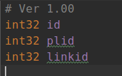

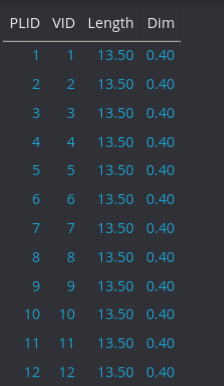


#### signal

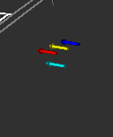

vid指的是此信号灯对应的vector,plid指其对应的pole

```c++
    visualization_msgs::MarkerArray createSignalMarkerArray(const VectorMap &vmap, Color red_color, Color blue_color,
                                                            Color yellow_color, Color other_color, Color pole_color) {
        visualization_msgs::MarkerArray marker_array;
        int id = 0;
        for (const auto &signal : vmap.findByFilter([](const Signal &signal) { return true; })) {
            if (signal.vid == 0) {
                ROS_ERROR_STREAM("[createSignalMarkerArray] invalid signal: " << signal);
                continue;
            }

            Vector vector = vmap.findByKey(Key<Vector>(signal.vid));//用vector来描述红绿灯
            if (vector.vid == 0) {
                ROS_ERROR_STREAM("[createSignalMarkerArray] invalid vector: " << vector);
                continue;
            }

            Pole pole;
            if (signal.plid != 0) {
                pole = vmap.findByKey(Key<Pole>(signal.plid));//找到相关联的pole
                if (pole.plid == 0) {
                    ROS_ERROR_STREAM("[createSignalMarkerArray] invalid pole: " << pole);
                    continue;
                }
            }

            visualization_msgs::Marker vector_marker;
            switch (signal.type) { //红绿灯颜色 红黄蓝
                case Signal::RED:
                case Signal::PEDESTRIAN_RED:
                    vector_marker = createVectorMarker("signal", id++, red_color, vmap, vector);
                    break;
                case Signal::BLUE:
                case Signal::PEDESTRIAN_BLUE:
                    vector_marker = createVectorMarker("signal", id++, blue_color, vmap, vector);
                    break;
                case Signal::YELLOW:
                    vector_marker = createVectorMarker("signal", id++, yellow_color, vmap, vector);
                    break;
                case Signal::RED_LEFT:
                    vector_marker = createVectorMarker("signal", id++, Color::LIGHT_RED, vmap, vector);
                    break;
                case Signal::BLUE_LEFT:
                    vector_marker = createVectorMarker("signal", id++, Color::LIGHT_GREEN, vmap, vector);
                    break;
                case Signal::YELLOW_LEFT:
                    vector_marker = createVectorMarker("signal", id++, Color::LIGHT_YELLOW, vmap, vector);
                    break;
                case Signal::OTHER:
                    vector_marker = createVectorMarker("signal", id++, other_color, vmap, vector);
                    break;
                default:
                    ROS_WARN_STREAM("[createSignalMarkerArray] unknown signal.type: " << signal.type
                                                                                      << " Creating Marker as OTHER.");
                    vector_marker = createVectorMarker("signal", id++, Color::GRAY, vmap, vector);
                    break;
            }
            if (isValidMarker(vector_marker))// action:ADD
                marker_array.markers.push_back(vector_marker);
            else
                ROS_ERROR_STREAM("[createSignalMarkerArray] failed createVectorMarker: " << vector);

            if (signal.plid != 0) {//创建pole
                visualization_msgs::Marker pole_marker = createPoleMarker("signal", id++, pole_color, vmap, pole);
                if (isValidMarker(pole_marker))
                    marker_array.markers.push_back(pole_marker);
                else
                    ROS_ERROR_STREAM("[createSignalMarkerArray] failed createPoleMarker: " << pole);
            }
        }
        return marker_array;
    }
```


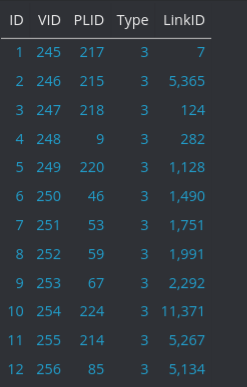

#### curb


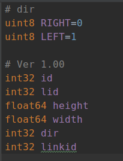


#### road edge


#### gutter


#### streetlight


#### utility pole


