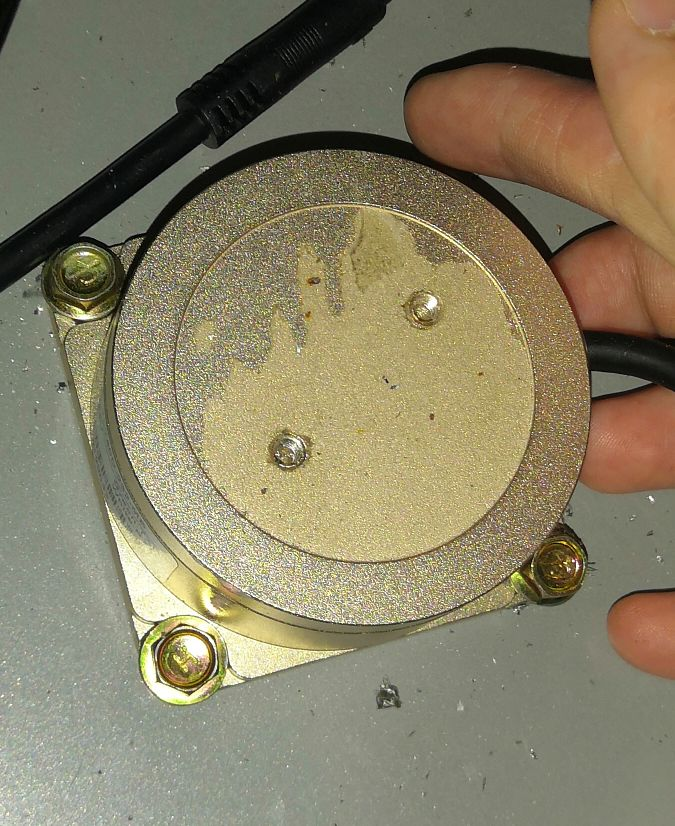
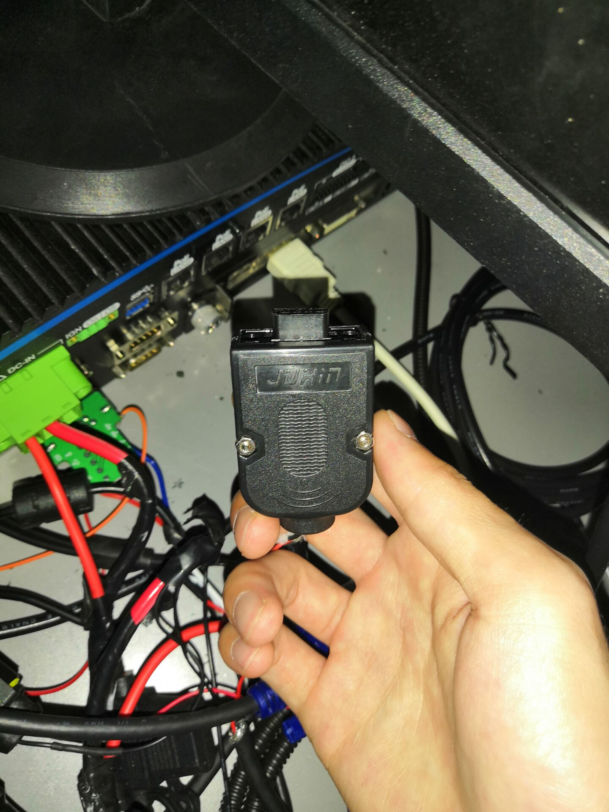
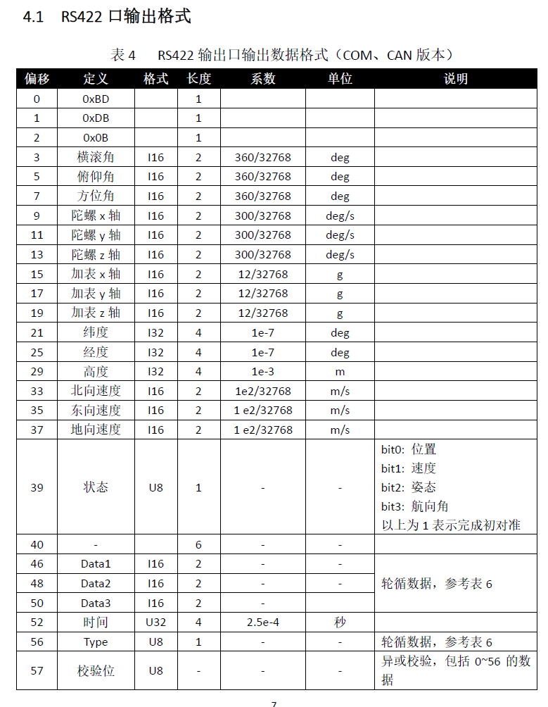
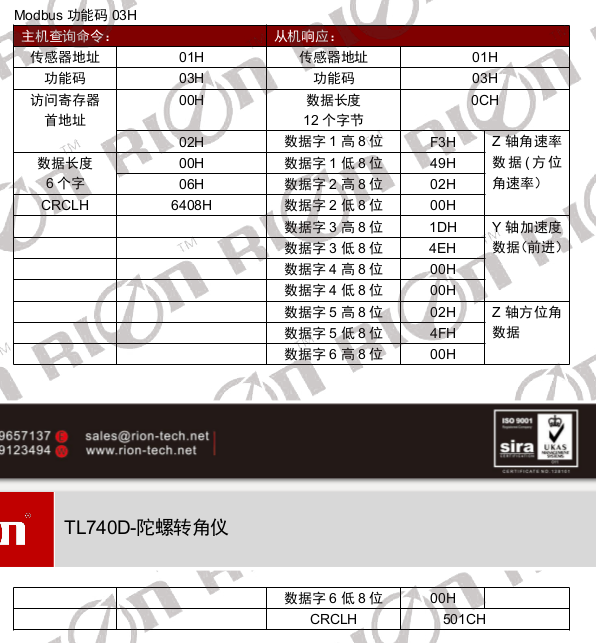
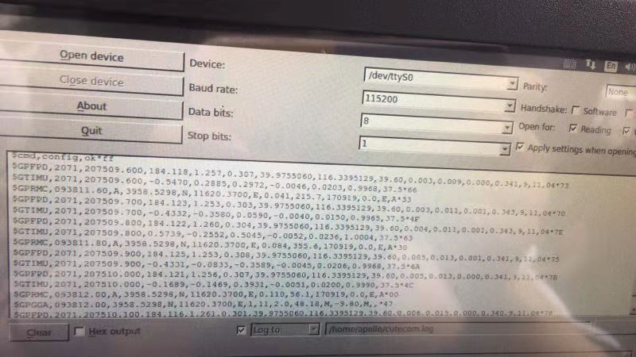

# 自动驾驶实战系列(四)——GPS/IMU驱动及协议解析

本来这部分内容在第三篇已经讲过，但是近期写了下RION TL740D的驱动，涉及到一些ROS下串口通信的知识，网上能够看到的一些代码写的都是玩具，稳定性比较差，所以这里准备总结一套通用的模板，后续可以自己修改着来适配自己的机器，无论是单独的GPS、IMU还是组合导航，均可以按以下讲解去写。感谢哈工大锦博士，对我指点颇多。

<!-- more -->

## 一、数据及通信协议

### 1、NMEA 0183

​	NMEA 0183是美国国家海洋电子协会（National Marine Electronics Association ）为海用电子设备制定的标准格式。目前业已成了GPS导航设备统一的RTCM（Radio Technical Commission for Maritime services）标准协议。GPS接收机根据NMEA-0183协议的标准规范，将位置、速度等信息通过串口传送到PC机、PDA等设备。大多数常见的GPS接收机、GPS数据处理软件、导航软件都遵守或者至少兼容这个协议。

​	NMEA-0183协议定义的语句非常多，但是常用的或者说兼容性最广的语句只有`$GPGGA、$GPGSA、$GPGSV、$GPRMC、$GPVTG、$GPGLL`等。下面贴一个GPGGA的字段说明示例。

`$GPGGA,092204.999,4250.5589,S,14718.5084,E,1,04,24.4,19.7,M,,,,0000*1F`

> - 字段0：$GPGGA，语句ID，表明该语句为Global Positioning System Fix Data（GGA）GPS定位信息。
>
> - 字段1：UTC 时间，hhmmss.sss，时分秒格式
>
> - 字段2：纬度ddmm.mmmm，度分格式（前导位数不足则补0）
>
> - 字段3：纬度N（北纬）或S（南纬）
>
> - 字段4：经度dddmm.mmmm，度分格式（前导位数不足则补0）
>
> - 字段5：经度E（东经）或W（西经）
>
> - 字段6：GPS状态，0=未定位，1=非差分定位，2=差分定位，3=无效PPS，6=正在估算
>
> - 字段7：正在使用的卫星数量（00 - 12）（前导位数不足则补0）
>
> - 字段8：HDOP水平精度因子（0.5 - 99.9）
>
> - 字段9：海拔高度（-9999.9 - 99999.9）
>
> - 字段10：地球椭球面相对大地水准面的高度
>
> - 字段11：差分时间（从最近一次接收到差分信号开始的秒数，如果不是差分定位将为空）
>
> - 字段12：差分站ID号0000 - 1023（前导位数不足则补0，如果不是差分定位将为空）
>
> - 字段13：校验值

实例

星网宇达M2系列

### 2、Modbus Rtu

#### 简介	

Modbus 一个工业上常用的通讯协议、一种通讯约定。已经成为工业通讯领域的业界标准，最初的ModBus仅支持串口，**分为RTU和ACSII两种信号传输模式**（一般基于RS485串口通信媒介）。而随着时代的变迁，ModBus**新增了TCP版本**，可以通过以太网进行通讯。和其他工业通信协议相比，ModBus主要的优点包括内容公开，无版权要求，不用支付额外的费用，硬件简单，容易部署。

​	ModBus采用半双工的通讯方式，由1个子站和多个从站组成，允许多个设备连接在同一个网络上进行通讯。上述三类对应的物理层：

- **ModBus TCP，以太网，RJ45。**

- **ModBus RTU/ASCII，异步串行通讯，RS232/485/422、光纤、无线**

- **ModBus Plus，高速令牌传递网络，同轴电缆或光缆。**

> 参考博客：[Modbus通讯协议（一）——概述](https://www.jianshu.com/p/35998a17ea3a)
>

在自动驾驶领域，使用的modbus协议一般是RTU传输方式，两者的主要区别如下

- **ModBus ASCII协议拥有开始和结束标记，ModBus RTU没有。**

- **ASCII协议的可读性强、传输效率低。**

- **RTU采用CRC校验，而ASCII采用LRC校验**

#### 实例

##### 组合导航INS550D

我手上拿到的这款INS550D输出数据有三路输出、输入接口

- RS232：差分4G定位
- RS422: 记录原始数据，即给用户使用的INS融合数据
- CAN口：转发CAN口，可接四轮轮速，档位和方向盘转角


这里是R422口输出融合的ins数据，输出波特率默认为230400，这里可以通过上位机软件重新设定波特率和频率。

> 这是一个衡量符号传输速率的参数。它表示每秒钟传送的符号的个数，波特率和距离成反比，高波特率常常用于放置的很近的仪器间的通信。

​	正常情况下从RS232差分口输出的是GPGGA/GPRMC协议格式的数据，如果想要GNSS原始数据，可以从差分口分两路出来，一路连接DTU，另外一路串口输出GGA和RMC格式数据。

> RS232和RS485的区别在于，RS232是要用在近距离传输上最大距离为30M，RS485用在长距离传输最大距离1200M。

​	RS422端口输出的是给用户的融合数据，这里是**BD DB 0B**为帧头的定长二进制数据。（有些厂商，比如星网宇达，直接输出类似差分口nmea数据，GPGGA/GTIMU/GPFPD等，传输的时候都是逐字节传，用char字符数组来接收数据，切割字符串即可）

##### RION TL740D

这是瑞芬科技出的一款IMU设备，也是串口通信，采用modbus rtu协议。






## 二、协议解析

下面分别给出modbus和nmea协议解析的示例代码和注意事项。

### Modbus Rtu

首先是INS550D这款设备，我们可以看其参考文档里面输出数据格式表。



以以上协议为例分析，帧头为`BD DB 0B`，一帧完整的数据58字节，最后一个字节为异异或校验位，从serial流中读取字节。可以通过帧头+长度+异或校验来解析一帧完整的数据。详细步骤就是，在buffer中去查找**帧头**，连帧头共**58帧**封装成一帧完整的数据，按字段和厂商提供的换算方式进行解析。最后用ROS发布出来，或`sensor_msg/Imu、sensor_msg/NavSatFix`标准格式，或者自定义msg格式。


下面是RION TL740D的角度读取格式表，类似上面的INS550D，这里帧头是`0x00`，定长，17字节为一帧完整的数据。解析的时候还是帧头+长度+校验，这里的校验是CRC16，循环冗余校验码，具体的算法流程我没有仔细研究，但会直接给出代码。



这里我们在工程实现上，我们用一个循环缓冲区去读buffer，然后解析一帧发布一帧。

首先初始化串口的一些基本参数，**注意波特率需要和上位机软件设定的一致**

```c++
bool InitPort(string port, string frame_id, int baudrate, int parity, int rionrate) {

    // init some param
    yaw.header.frame_id = frame_id;
    yaw.orientation.w = 1.0;
    yaw.orientation.x = 0.0;
    yaw.orientation.y = 0.0;
    yaw.orientation.z = 0.0;

    have_new_data = false;// 一帧数据解析完的标志位

    // 设定奇偶校验位
    serial::parity_t parity_;
    switch (parity) {
        case 0:
            parity_ = serial::parity_none;
            break;
        case 1:
            parity_ = serial::parity_odd; // 奇校验
            break;
        case 2:
            parity_ = serial::parity_even; // 偶校验
            break;
        case 3:
            parity_ = serial::parity_mark;
            break;
        case 4:
            parity_ = serial::parity_space;
            break;
        default:
        ROS_ERROR_STREAM("invalid serial parity setting, parity set is "
        << parity);
        break;
    }

    //设置串口属性，并打开串口
    try {
        ser.setPort(port);
        ser.setBaudrate(baudrate);
        serial::Timeout to = serial::Timeout::simpleTimeout(1000);
        ser.setTimeout(to);
        ser.open();
    }
    catch (serial::IOException &e) {
        ROS_ERROR_STREAM("Unable to open port ");
        return false;
   }
```

这里注意，modbus在解析的时候，由于是半双工通信，所以需要丛机向主机请求数据，主机响应。

发布imu话题

```c++
ros::Publisher yaw_data_pub = nh_priv.advertise<sensor_msgs::Imu>(imu_topic, 1); //缓冲区不要太大
ros::Rate loopRate(200); //这里的发布频率需要比串口传输数据的频率快
```

初始化一个循环队列，把buffer中每一个字节的数据往里面装，之后在循环读取->解析数据即可

```c++
Queue quene();//写一个循环队列的类

while (ros::ok()) {
    if (quene.ser.available()) { //我的serial::serial ser是全局变量
        size_t m = quene.ser.available();
        if (m != 0) {
            uint8_t buffer[1024];
            m = quene.ser.read(buffer, m);//读串口，装到buffer里面

            for (int i = 0; i < m; i++) {
                if (quene.EnQueue(buffer[i])) // 缓冲区满了返回false
                {
                    cout << "EnQueue error" << endl;
                }
            }

            quene.HandleData(); //此函数解析串口数据
            if (quene.have_new_data) { //解析完新的一帧就发布出去
                yaw_data_pub.publish(quene.publishNewData(true, true));
                quene.have_new_data = false;
            }
        }
    } else {
        cout << "waiting data." << endl;
    }

    //处理ROS的信息，比如订阅消息,并调用回调函数
    ros::spinOnce();
    loopRate.sleep();
}
```

最后是解析数据帧，这里有一个常用的写法

```c++
//按字节读16进制数据，按高低位拼成4字节
frame_len = ((uint32_t) GetQueue(i++));
frame_len |= ((uint32_t) GetQueue(i++)) << 8;
frame_len |= ((uint32_t) GetQueue(i++)) << 16;
frame_len |= ((uint32_t) GetQueue(i++)) << 24;

zw = (static_cast<double>(frame_len) - 150000) * 0.01;
```

CRC16校验，需要知道这一帧的每一个字节数据，建议单独保存在一个uint8_t数组中

```c++
uint8_t tmp[15] = {0};
// 把每一位数据添加到tmp数组，代码类似，自己改一下
if (i + 15 < len) {
    tmp[1] = 0x03;
    tmp[2] = GetQueue(i++);//这里帧头和规定的第二字节数据已经做出判断

    for (int j = 0; j < 11; ++j) { //之后的每一个字节和队列中的下标一致
        tmp[3 + j] = GetQueue(i + j);
    }
}

uint16_t getCode = GetCrcData(tmp, 15);//判断数据帧的校验和是否与CRC16计算的一致
if (crc_check == GetCrcData(tmp, 15)) {
    have_new_data = true;
}

uint16_t GetCrcData(uint8_t *buffer, uint32_t len) {
    uint16_t wcrc = 0XFFFF;//16位crc寄存器预置
    uint8_t temp;
    uint32_t i = 0, j = 0;//计数
    for (i = 0; i < len; i++)//循环计算每个数据
    {
        temp = *buffer & 0X00FF;//将八位数据与crc寄存器亦或
        buffer++;//指针地址增加，指向下个数据
        wcrc ^= temp;//将数据存入crc寄存器
        for (j = 0; j < 8; j++)//循环计算数据的
        {
            if (wcrc & 0X0001)//判断右移出的是不是1，如果是1则与多项式进行异或。
            {
                wcrc >>= 1;//先将数据右移一位
                wcrc ^= 0XA001;//与上面的多项式进行异或
            } else//如果不是1，则直接移出
            {
                wcrc >>= 1;//直接移出
            }
        }
    }
    uint8_t CRC_L;//定义数组
    uint8_t CRC_H;
    CRC_L = wcrc & 0xff;//crc的低八位
    CRC_H = wcrc >> 8;//crc的高八位
    return ((CRC_H << 8) | CRC_L);
}
```

总结，在此类串口通信时，需要注意以下两点

- 丢弃错误帧，保证发布出来的数据完全无误（帧头+长度+异或校验）
- ros的发布频率必须快于imu串口（否则可能导致数据延迟）

### NMEA 0183

#### 星网宇达M2



​	一般来说，如果直接读取差分口数据，类似星网宇达(无DTU)，则可直接获取类似以上**$GPGGA**开头的nmea数据。这种相对来说比较容易，因为一行一帧数据，只需要校验每一行数据是否正常，无需手动通过帧头帧尾去分封帧。而是逐行读取，按字段分割即可，这里感谢自动化所飞哥提供的代码，网上也可以搜到很多类似。

```python
while not rospy.is_shutdown():
    g = 9.81
    if (ser.read() != '$'):
        continue
        line0 = ser.readline() #逐行读取，按'，'分割
        cs = line0[-4:-2]
        cs1 = int(cs, 16)
        cs2 = checksum(line0)
        if (cs1 != cs2):
            continue
            line = line0.replace("\r\n", " ")
            line = line.replace("*", ",")
            words = string.split(line, ",")
```

**GTIMU/GPFPD协议解析**

```python
 # 协议字段解析
    if words[0] == "GTIMU":
        GPSWeek = string.atoi(words[1])
        GPSTime = string.atof(words[2])
        GyroX = string.atof(words[3])
        GyroY = string.atof(words[4])
        GyroZ = string.atof(words[5])
        AccX = string.atof(words[6])
        AccY = string.atof(words[7])
        AccZ = string.atof(words[8])
        Tpr = string.atof(words[9])
    elif words[0] == "GPFPD":
        GPSWeek = string.atoi(words[1])
        GPSTime = string.atof(words[2])
        Heading = string.atof(words[3])
        Pitch = string.atof(words[4])
        Roll = string.atof(words[5])
        Lattitude = string.atof(words[6])
        Longitude = string.atof(words[7])
        Altitude = string.atof(words[8])
        Ve = string.atof(words[9])
        Vn = string.atof(words[10])
        Vu = string.atof(words[11])
        Baseline = string.atof(words[12])
        NSV1 = string.atoi(words[13])
        NSV2 = string.atoi(words[14])
        Status = words[15]

     if (ser.read() != '$'):
         continue
```

**Imu /Gps数据发布**

```python
q_avg =tf.transformations.quaternion_from_euler(numpy.deg2rad(Roll), numpy.deg2rad(Pitch), numpy.deg2rad(Heading))  

# imu data
    Imumsg.angular_velocity.x = numpy.deg2rad(GyroX)
    Imumsg.angular_velocity.y = numpy.deg2rad(GyroY)
    Imumsg.angular_velocity.z = numpy.deg2rad(GyroZ)
    Imumsg.linear_acceleration.x = AccX*g
    Imumsg.linear_acceleration.y = AccY*g
    Imumsg.linear_acceleration.z = AccZ*g
    Imumsg.orientation.w = q_avg[3]
    Imumsg.orientation.x = q_avg[0]
    Imumsg.orientation.y = q_avg[1]
    Imumsg.orientation.z = q_avg[2]
    Imumsg.header.stamp = rospy.Time.now()
    Imumsg.header.frame_id = 'imu_node'
    Imumsg.header.seq = seq
# gps data
    GPSmsg.latitude = Lattitude
    GPSmsg.longitude = Longitude
    GPSmsg.altitude = Altitude
    #GPSmsg.status.status = Status
    GPSmsg.header.stamp = rospy.Time.now()
    GPSmsg.header.frame_id = 'gps_node'
    GPSmsg.header.seq = seq

    Velmsg.twist.linear.x = math.sqrt(Ve**2 + Vn ** 2)
    Velmsg.twist.linear.y = 0
    Velmsg.twist.linear.z = 0
    Velmsg.twist.angular.x = 0
    Velmsg.twist.angular.y = 0
    Velmsg.twist.angular.z = numpy.deg2rad(GyroZ)
# pub
    if (Status == '00'):
    print("init")
    if (Status == '01'):
    print("coarse alignment")
    if(Status == '02'):
    print("fine alignment")
    if(Status == '03'):
    print("gps direction")
    if(Status == '04'):
    print("gps localization")
    if(Status == '05'):
    print("rtk")
    print('pub')
    pub_gps.publish(GPSmsg)
    pub_imu.publish(Imumsg)
    pub_vel.publish(Velmsg)
    seq = seq + 1
    rate.sleep()
```

## 三、致谢

参考：INS550D、MD-649说明手册

感谢：一清创新RAMLAB、导远电子程工、中科院自动化所飞哥、主线科技刘工、哈工大刘博等